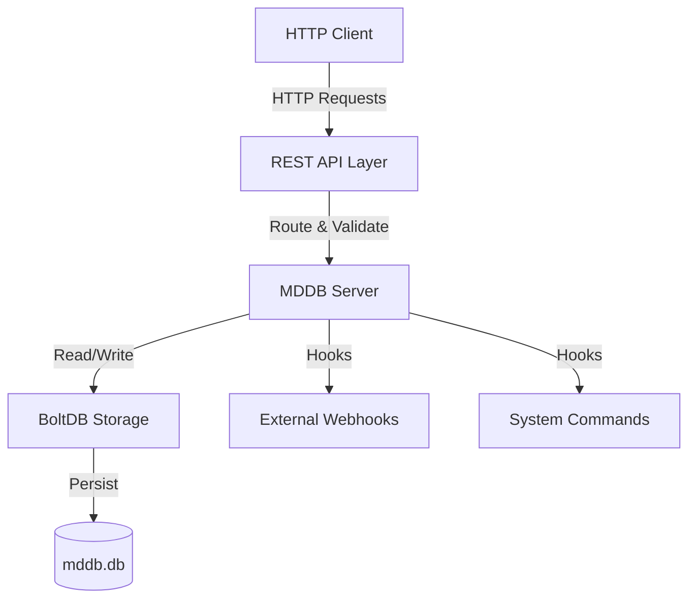
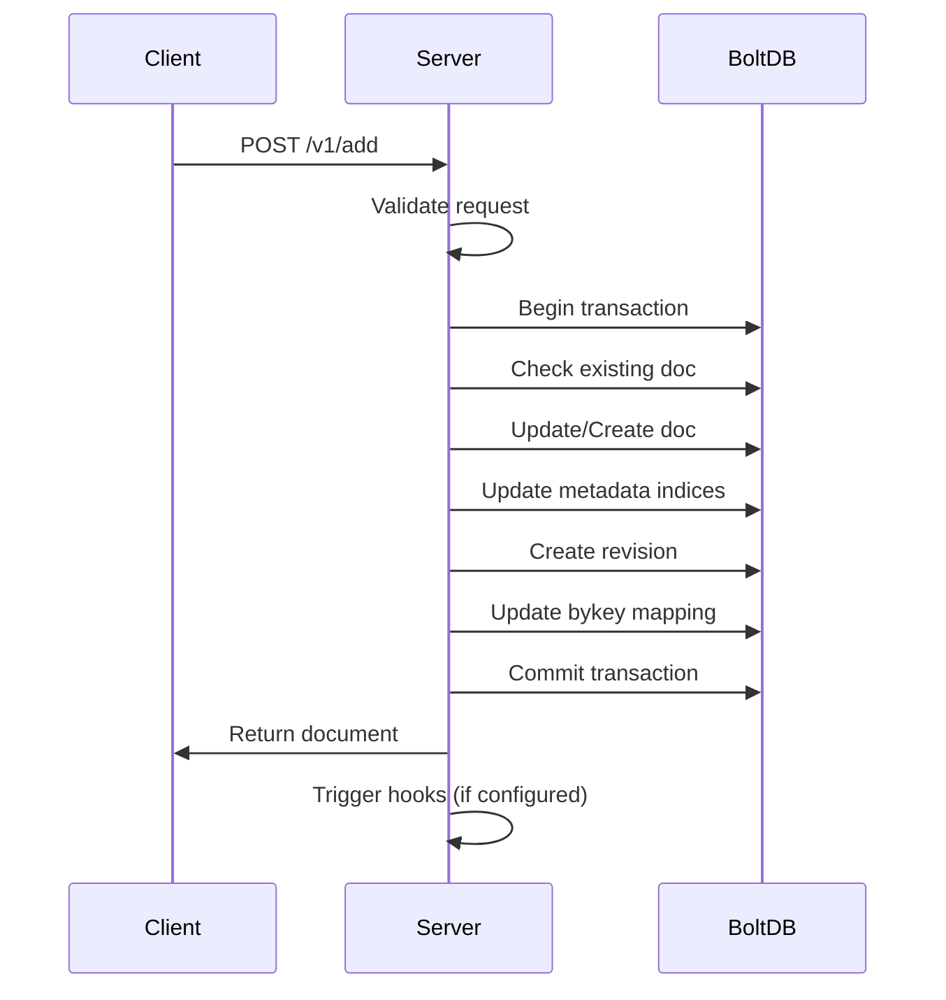
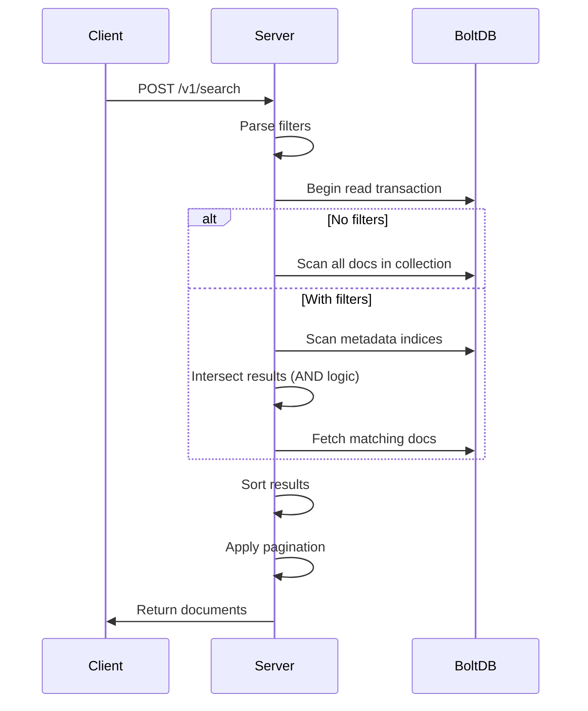
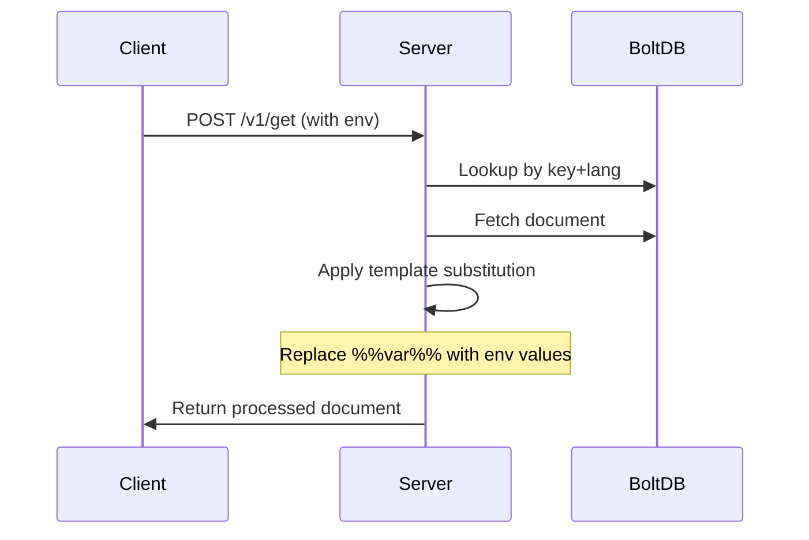

# MDDB Architecture

> **Note**: This document describes the foundational architecture (storage layout, request flow). For an up-to-date list of every shipped subsystem (vector search, FTS, geo, MCP, GraphQL, auth, replication, TLS, UDS, etc.) see [FEATURES.md](FEATURES.md) and the canonical version table in the root [README.md](../README.md).

## Overview

MDDB is an AI-native embedded document database built on top of BoltDB. It serves a triple-protocol surface — **HTTP/JSON REST**, **gRPC/Protobuf**, and **GraphQL** — over either TCP or Unix Domain Sockets, with optional TLS / mTLS. A built-in **MCP server** (67 tools, MCP 2025-11-25) exposes the same operations to LLM agents over stdio, Streamable HTTP, and SSE transports.

Search is a layered stack: metadata indexes for filter pre-pruning, **full-text search** (TF-IDF / BM25 / BM25F / PMISparse, 7 modes, 18-language stemming, fuzzy / proximity), **vector / semantic search** (Flat / HNSW / IVF / PQ / OPQ / SQ / BQ + per-collection int8/int4 quantization, plug-in OpenAI / Ollama / Cohere / Voyage embeddings), **geospatial search** (R-tree + geohash), and **hybrid search** that combines BM25 and dense vectors via alpha blending or Reciprocal Rank Fusion.

Beyond storage and search, MDDB ships **JWT authentication + RBAC**, **mTLS client-cert auth**, **leader-follower binlog replication**, **automation** (triggers / crons / webhooks / sentiment / template variables), **document TTL**, **revisions**, **schema validation**, **aggregations**, and a **React admin panel**.

## High-Level Architecture



## Components

### 1. Protocol layer (HTTP / gRPC / GraphQL / MCP)

Routes requests to handlers, applies middleware (JSON, CORS, auth, rate limit, logging), enforces access modes.

For the **full endpoint catalogue** see [API.md](API.md) (HTTP/REST), [GRPC.md](GRPC.md) (gRPC), [GRAPHQL.md](GRAPHQL.md) (GraphQL schema), [MCP.md](MCP.md) (MCP tools), and the live Swagger UI at `/docs/api/swagger.html`. The endpoint list lives in [services/mddbd/endpoints_handlers.go](../services/mddbd/endpoints_handlers.go) and is queryable at `GET /v1/endpoints`.

### 2. Storage Layer (BoltDB)

**Database Structure**:

```
mddb.db
├── docs/          # Current document versions
│   └── doc|{collection}|{docID} → JSON
├── idxmeta/       # Metadata indices
│   └── meta|{collection}|{key}|{value}|{docID} → 1
├── rev/           # Revision history
│   └── rev|{collection}|{docID}|{timestamp} → JSON
└── bykey/         # Key-to-ID mapping
    └── bykey|{collection}|{key}|{lang} → docID
```

**Foundational buckets** (the four every collection always uses):

1. **`docs`** — latest document version. Key: `doc|{collection}|{docID}`. Value: protobuf-encoded `Doc` (compressed via the configured codec).
2. **`idxmeta`** — metadata index for fast filter pre-pruning. Key: `meta|{collection}|{metaKey}|{metaValue}|{docID}`. Value: existence marker. Enables prefix scans.
3. **`rev`** — revision history. Key: `rev|{collection}|{docID}|{timestamp}`. Value: encoded document snapshot, sorted by timestamp.
4. **`bykey`** — key/lang → docID lookup. Key: `bykey|{collection}|{key}|{lang}`.

Subsystems add their own buckets on top: `vectors`, `vector_meta` (vector store), `fts_*` (full-text inverted index, stop words, synonyms, BM25 stats), `geo` (R-tree + geohash), `webhooks`, `schemas`, `auth_users` / `auth_apikeys` / `auth_perms` / `auth_groups`, `automation`, `automation_log`, `binlog` (replication), `mcp_apikeys`, `memory_*` (RAG sessions), and `ttl_*`. Each is initialised by its owning module's `EnsureBucket()` call at startup.

## Data Flow

### Add/Update Document



### Search Documents



### Hybrid / FTS / Vector / Geo search

These four search subsystems each have a dedicated guide — this file does not duplicate the algorithm or API details:

- **[SEARCH.md](SEARCH.md)** — full-text search modes, BM25/BM25F/PMISparse scoring, multi-language stemming, fuzzy/proximity, vector index algorithms (Flat, HNSW, IVF, PQ, OPQ, SQ, BQ), quantization
- **[PMISPARSE.md](PMISPARSE.md)** — the BM25 + PPMI two-phase ranker
- **[RAG-PIPELINE.md](RAG-PIPELINE.md)** — hybrid search (alpha blending and Reciprocal Rank Fusion), retrieval-augmented generation patterns
- **[GEOSEARCH.md](GEOSEARCH.md)** — R-tree and geohash indexes, radius / bbox queries, composition with FTS and vector
- **[EMBEDDING_PROVIDERS.md](EMBEDDING_PROVIDERS.md)** — OpenAI / Ollama / Cohere / Voyage configuration

### Get Document with Templating



## Key Design Decisions

### 1. Deterministic IDs

Documents are identified by: `{collection}|{key}|{lang}`

**Benefits**:
- Predictable IDs
- Natural deduplication
- Easy to reason about
- No need for separate ID generation

### 2. Metadata as Multi-Value Maps

Metadata: `map[string][]string`

**Benefits**:
- Flexible schema
- Multiple values per key (tags, categories)
- Easy to query and filter
- Indexed for performance

### 3. Prefix-Based Indexing

Index keys: `meta|{collection}|{key}|{value}|{docID}`

**Benefits**:
- Fast prefix scans in BoltDB
- Efficient range queries
- No need for secondary indices
- Automatic sorting

### 4. Revision History

Every update creates a new revision with timestamp.

**Benefits**:
- Full audit trail
- Point-in-time recovery
- Change tracking
- Can be truncated to save space

### 5. Embedded Database (BoltDB)

**Benefits**:
- No external dependencies
- Single file storage
- ACID transactions
- Fast local access
- Easy backup/restore

**Trade-offs**:
- Single-writer (not an issue for most use cases)
- Not distributed
- Limited to single machine

## Access Modes

### Read Mode (`read`)
- Only GET operations allowed
- Write operations return 403
- Useful for read replicas

### Write Mode (`write`)
- Only write operations allowed
- Rarely used in practice

### Read-Write Mode (`wr`)
- All operations allowed
- Default and recommended mode

## Extension Points

### Webhooks, Automation, Custom MCP tools

MDDB exposes three layered extension mechanisms — each documented in its own file:

- **[WEBHOOKS.md](WEBHOOKS.md)** — HTTP webhooks fired on document events (`doc.added`, `doc.updated`, `doc.deleted`, batch events). Per-collection scoping, retry with backoff, payload signing.
- **[AUTOMATIONS.md](AUTOMATIONS.md)** — triggers, crons, conditional rules, sentiment analysis, template variables. Configurable via REST/gRPC/MCP.
- **[CUSTOM-TOOLS.md](CUSTOM-TOOLS.md)** — YAML-defined custom MCP tools that wrap built-in actions (`semantic_search`, `search_documents`, `full_text_search`, `fts_languages`) with domain-specific defaults so AI agents see purpose-built tools instead of generic primitives.

## Performance Characteristics

### Read Performance
- **Get by key**: O(log n) - BoltDB B+tree lookup
- **Search with metadata**: O(m * log n) - where m = matching documents
- **Full collection scan**: O(n) - linear scan

### Write Performance
- **Add/Update**: O(log n + m) - where m = metadata keys
- **Index updates**: O(k) - where k = number of metadata values

### Storage
- **Document size**: Typically 1-100 KB
- **Metadata overhead**: ~100 bytes per key-value pair
- **Revision overhead**: Full document copy per revision
- **Index overhead**: ~50 bytes per indexed value

## Scalability Considerations

### Vertical Scaling
- BoltDB performs well with SSDs
- Memory-map for faster reads
- Single-writer limitation

### Horizontal Scaling
- Run multiple read-only instances
- Single write instance
- File-based replication
- Consider sharding by collection

### Database Size
- Suitable for: 10K - 1M documents
- Document size: < 1 MB each
- Total DB size: < 10 GB recommended
- Regular revision truncation important

## Security Considerations

### What ships in MDDB today (2.9.11+)
- **JWT authentication** with bcrypt password hashes — see [services/mddbd/auth_manager.go](../services/mddbd/auth_manager.go) and [AUTHENTICATION.md](AUTHENTICATION.md)
- **API keys** with optional expiry, per-user issuance, scoped permissions
- **RBAC**: per-collection Read/Write/Admin permissions with user and group resolution
- **Per-protocol access modes**: `MDDB_MCP_MODE`, `MDDB_API_MODE`, `MDDB_GRPC_MODE`, `MDDB_HTTP3_MODE` to lock individual protocols to read-only without disabling them
- **TLS / HTTPS**: built-in `MDDB_TLS_ENABLED=true` with user-supplied PEM cert + key, TLS 1.2 minimum — see [TLS.md](TLS.md)
- **Mutual TLS (mTLS)**: `MDDB_TLS_CLIENT_CA` + `MDDB_TLS_CLIENT_AUTH=require|request` for certificate-based client authentication
- **Unix Domain Socket transport**: `MDDB_HTTP_ADDR=unix:/var/run/mddb/http.sock` (and `MDDB_GRPC_ADDR=unix:...`) for zero-network local deployments. UDS is created with `0600` filesystem perms — peer is authenticated by file ownership before any application-level auth runs
- **MCP API key middleware**: separate key store and rate-limit chain for the MCP HTTP transport ([services/mddbd/mcp_apikeys.go](../services/mddbd/mcp_apikeys.go))

### What's still on the user
- **Encryption at rest** — BoltDB stores plaintext on disk. Encrypt the underlying filesystem (LUKS, FileVault, dm-crypt) or the volume.
- **Network exposure** — even with TLS + JWT enabled, prefer to bind MDDB to a private interface or a UDS path and front it with a reverse proxy that adds WAF / rate limit / DDoS protection if it's reachable from the public internet.
- **Backup encryption** — `/v1/backup` produces a plaintext copy of the BoltDB file. Encrypt the resulting blob (age, gpg) before uploading to remote storage.
- **Cert / key rotation** — TLS certs are loaded once at startup. Restart the process on rotation; there is no SIGHUP reloader yet.

4. **Access Control**:
   - Implement collection-level permissions
   - Add user roles
   - Audit logging

## Monitoring & Observability

### Metrics to Track
- Request rate per endpoint
- Response times
- Database size
- Number of documents
- Number of revisions
- Error rates

### Logging
- Request/response logging
- Error logging
- Audit trail for writes
- Performance logging

### Health Checks
- Database connectivity
- Disk space
- Memory usage
- Response time

## Roadmap

The roadmap lives in its own file and is updated per release: see [ROADMAP.md](ROADMAP.md) for current and planned work.

> **Note**: a previous version of this document listed "Full-Text Search", "Authentication", "Replication", "GraphQL", "Schema validation", "Compression", "Multi-language search" and "Rate limiting" as *future* enhancements. **All of those have shipped** — see [FEATURES.md](FEATURES.md) for the current capability matrix. The list was removed in the 2.9.11 docs cleanup.
