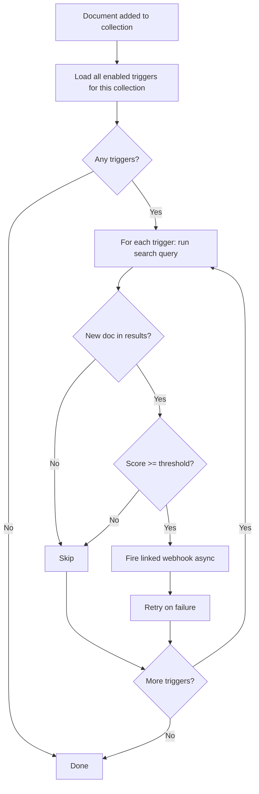
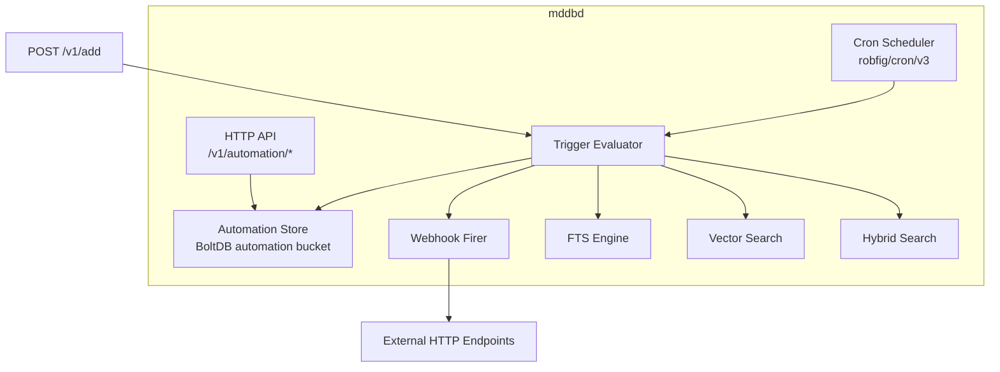

# MDDB Automations (v2.7.1)

MDDB supports an **automation system** for reactive and scheduled workflows. Define webhook targets, create triggers that fire when documents match search criteria, and schedule periodic trigger execution with cron jobs. All three types are stored in a single `automation` BoltDB bucket and managed through a unified REST API.

## Table of Contents

- [Overview](#overview)
- [Quick Start](#quick-start)
- [Configuration](#configuration)
- [Data Model](#data-model)
- [API Reference](#api-reference)
- [Webhook Payload](#webhook-payload)
- [Trigger Evaluation](#trigger-evaluation)
- [Cron Scheduling](#cron-scheduling)
- [Panel UI](#panel-ui)
- [Architecture](#architecture)

---

## Overview

The automation system has three rule types:

| Type | Purpose | Env Var |
|------|---------|---------|
| **Webhook** | Named HTTP endpoint target (URL, method, headers) | `MDDB_WEBHOOKS=true` |
| **Trigger** | Fire a webhook when a new document matches a search query above a threshold | `MDDB_TRIGGERS=true` |
| **Cron** | Execute a trigger on a recurring schedule | `MDDB_CRONS=true` |

All three types share the same API endpoints and are distinguished by the `type` field. Each type can be independently enabled or disabled via environment variables.

### How It Fits Together

```
Document added to collection
        |
        v
  Trigger evaluates search query
        |
        v
  New doc in results AND score >= threshold?
        |
    yes |
        v
  Linked webhook fires HTTP request
```

Cron jobs add a time dimension: instead of reacting to new documents, they run a trigger's search on a schedule and fire the webhook for **all** matches above threshold.

---

## Quick Start

### 1. Create a Webhook

Define where notifications should be sent:

```bash
curl -X POST http://localhost:11023/v1/automation \
  -H "Content-Type: application/json" \
  -d '{
    "type": "webhook",
    "name": "Slack Alert",
    "url": "https://hooks.slack.com/services/T00/B00/xxx",
    "method": "POST",
    "headers": {
      "Content-Type": "application/json"
    },
    "enabled": true
  }'
```

Save the returned `id` (e.g., `wh_abc123`).

### 2. Create a Trigger

Define what search criteria should fire the webhook:

```bash
curl -X POST http://localhost:11023/v1/automation \
  -H "Content-Type: application/json" \
  -d '{
    "type": "trigger",
    "name": "AI Article Alert",
    "collection": "articles",
    "searchType": "fts",
    "query": "artificial intelligence machine learning",
    "threshold": 5,
    "webhookId": "wh_abc123",
    "enabled": true
  }'
```

Save the returned `id` (e.g., `tr_def456`).

### 3. Test the Trigger (Dry Run)

Run the trigger's search without actually firing the webhook:

```bash
curl -X POST http://localhost:11023/v1/automation/tr_def456/test
```

This returns matching documents and their scores so you can verify the threshold before going live.

### 4. Add a Document to Fire the Trigger

With `MDDB_TRIGGERS=true`, adding a matching document will evaluate all enabled triggers:

```bash
curl -X POST http://localhost:11023/v1/add \
  -H "Content-Type: application/json" \
  -d '{
    "collection": "articles",
    "key": "new-ai-breakthrough",
    "lang": "en_US",
    "contentMd": "# New AI Breakthrough\n\nResearchers have achieved a major advance in machine learning...",
    "meta": {
      "category": "technology",
      "tags": ["ai", "machine-learning"]
    }
  }'
```

If the new document appears in the trigger's search results with a BM25 score >= 5, the Slack webhook fires automatically.

---

## Configuration

### Environment Variables

| Variable | Default | Description |
|----------|---------|-------------|
| `MDDB_WEBHOOKS` | `false` | Enable the webhook subsystem (required for any webhook to fire) |
| `MDDB_TRIGGERS` | `false` | Enable real-time trigger evaluation after document add |
| `MDDB_CRONS` | `false` | Enable the cron scheduler for periodic trigger execution |

All three are opt-in. You can create automation rules via the API regardless of these flags, but the rules will only execute when the corresponding flag is enabled.

### Docker Example

```bash
docker run -d \
  -p 11023:11023 \
  -e MDDB_WEBHOOKS=true \
  -e MDDB_TRIGGERS=true \
  -e MDDB_CRONS=true \
  -v /data:/data \
  tradik/mddb:latest
```

### docker-compose.yml

```yaml
services:
  mddb:
    image: tradik/mddb:latest
    ports:
      - "11023:11023"
    volumes:
      - mddb-data:/data
    environment:
      MDDB_WEBHOOKS: "true"
      MDDB_TRIGGERS: "true"
      MDDB_CRONS: "true"

volumes:
  mddb-data:
```

---

## Data Model

All automation rules are stored as `AutomationRule` in the `automation` BoltDB bucket. The `type` field determines which fields are relevant.

### Common Fields

| Field | Type | Description |
|-------|------|-------------|
| `id` | string | Auto-generated unique identifier |
| `type` | string | `"webhook"`, `"trigger"`, or `"cron"` |
| `name` | string | Human-readable name |
| `enabled` | bool | Whether the rule is active |
| `createdAt` | int64 | Unix timestamp of creation |
| `updatedAt` | int64 | Unix timestamp of last update |

### Webhook Fields

| Field | Type | Default | Description |
|-------|------|---------|-------------|
| `url` | string | (required) | Target HTTP URL |
| `method` | string | `"POST"` | HTTP method: `POST`, `GET`, or `PUT` |
| `headers` | map[string]string | `{}` | Custom HTTP headers to include in the request |

### Trigger Fields

| Field | Type | Default | Description |
|-------|------|---------|-------------|
| `collection` | string | (required) | Collection to watch |
| `searchType` | string | (required) | Search method: `"fts"`, `"vector"`, or `"hybrid"` |
| `query` | string | (required) | Search query text |
| `threshold` | float64 | `0` | Minimum score to fire (see [Trigger Evaluation](#trigger-evaluation)) |
| `webhookId` | string | (required) | ID of the webhook to fire |
| `searchParams` | object | `{}` | Optional extra search parameters (e.g., `alpha`, `strategy`, `algorithm`) |

### Cron Fields

| Field | Type | Default | Description |
|-------|------|---------|-------------|
| `schedule` | string | (required) | Cron expression (e.g., `"0 9 * * *"`) |
| `triggerId` | string | (required) | ID of the trigger to execute |
| `lastRun` | int64 | `0` | Unix timestamp of last execution |
| `nextRun` | int64 | `0` | Unix timestamp of next scheduled execution |

---

## API Reference

All endpoints are under `/v1/automation`. Requests and responses use JSON.

### List Rules

```
GET /v1/automation
GET /v1/automation?type=webhook
GET /v1/automation?type=trigger
GET /v1/automation?type=cron
```

Returns all automation rules, optionally filtered by type.

```bash
# List all rules
curl http://localhost:11023/v1/automation

# List only webhooks
curl http://localhost:11023/v1/automation?type=webhook

# List only triggers
curl http://localhost:11023/v1/automation?type=trigger

# List only crons
curl http://localhost:11023/v1/automation?type=cron
```

**Response:**
```json
[
  {
    "id": "wh_abc123",
    "type": "webhook",
    "name": "Slack Alert",
    "url": "https://hooks.slack.com/services/T00/B00/xxx",
    "method": "POST",
    "headers": {},
    "enabled": true,
    "createdAt": 1709510400,
    "updatedAt": 1709510400
  }
]
```

### Create Rule

```
POST /v1/automation
```

Create a new automation rule. The `type` field determines which fields are required.

**Create a webhook:**
```bash
curl -X POST http://localhost:11023/v1/automation \
  -H "Content-Type: application/json" \
  -d '{
    "type": "webhook",
    "name": "PagerDuty",
    "url": "https://events.pagerduty.com/v2/enqueue",
    "method": "POST",
    "headers": {
      "Content-Type": "application/json",
      "Authorization": "Token token=your-pd-token"
    },
    "enabled": true
  }'
```

**Create a trigger (FTS):**
```bash
curl -X POST http://localhost:11023/v1/automation \
  -H "Content-Type: application/json" \
  -d '{
    "type": "trigger",
    "name": "Security Alert",
    "collection": "incidents",
    "searchType": "fts",
    "query": "vulnerability CVE critical",
    "threshold": 3,
    "webhookId": "wh_abc123",
    "enabled": true
  }'
```

**Create a trigger (vector):**
```bash
curl -X POST http://localhost:11023/v1/automation \
  -H "Content-Type: application/json" \
  -d '{
    "type": "trigger",
    "name": "Similar Content Detector",
    "collection": "blog",
    "searchType": "vector",
    "query": "kubernetes deployment best practices",
    "threshold": 80,
    "webhookId": "wh_abc123",
    "enabled": true
  }'
```

**Create a trigger (hybrid with extra params):**
```bash
curl -X POST http://localhost:11023/v1/automation \
  -H "Content-Type: application/json" \
  -d '{
    "type": "trigger",
    "name": "Hybrid Alert",
    "collection": "docs",
    "searchType": "hybrid",
    "query": "breaking change API deprecation",
    "threshold": 60,
    "webhookId": "wh_abc123",
    "searchParams": {
      "strategy": "alpha",
      "alpha": 0.6,
      "algorithm": "bm25f"
    },
    "enabled": true
  }'
```

**Create a cron:**
```bash
curl -X POST http://localhost:11023/v1/automation \
  -H "Content-Type: application/json" \
  -d '{
    "type": "cron",
    "name": "Daily Security Scan",
    "schedule": "0 9 * * *",
    "triggerId": "tr_def456",
    "enabled": true
  }'
```

### Get Rule

```
GET /v1/automation/{id}
```

```bash
curl http://localhost:11023/v1/automation/wh_abc123
```

### Update Rule

```
PUT /v1/automation/{id}
```

Send the full updated rule body. Fields not included will be reset to defaults.

```bash
curl -X PUT http://localhost:11023/v1/automation/tr_def456 \
  -H "Content-Type: application/json" \
  -d '{
    "type": "trigger",
    "name": "Security Alert (updated)",
    "collection": "incidents",
    "searchType": "fts",
    "query": "vulnerability CVE critical zero-day",
    "threshold": 2,
    "webhookId": "wh_abc123",
    "enabled": true
  }'
```

### Delete Rule

```
DELETE /v1/automation/{id}
```

```bash
curl -X DELETE http://localhost:11023/v1/automation/tr_def456
```

### Test Trigger (Dry Run)

```
POST /v1/automation/{id}/test
```

Runs the trigger's search query and returns all matching documents with their scores. Does **not** fire the webhook. Only works on rules with `type=trigger`.

```bash
curl -X POST http://localhost:11023/v1/automation/tr_def456/test
```

**Response:**
```json
{
  "trigger": {
    "id": "tr_def456",
    "name": "Security Alert"
  },
  "matches": [
    {
      "document": {
        "id": "doc1",
        "key": "cve-2026-1234",
        "contentMd": "# Critical CVE-2026-1234...",
        "meta": {"severity": "critical"}
      },
      "score": 8.2
    },
    {
      "document": {
        "id": "doc2",
        "key": "vuln-report-march",
        "contentMd": "# Vulnerability Report...",
        "meta": {"severity": "high"}
      },
      "score": 4.1
    }
  ],
  "total": 2,
  "threshold": 3
}
```

---

## Webhook Payload

When a trigger fires, MDDB sends an HTTP request to the linked webhook URL with the following JSON body:

```json
{
  "event": "trigger.matched",
  "trigger": {
    "id": "tr_def456",
    "name": "Security Alert"
  },
  "collection": "incidents",
  "document": {
    "id": "doc1",
    "key": "cve-2026-1234",
    "lang": "en_US",
    "contentMd": "# Critical CVE-2026-1234...",
    "meta": {
      "severity": "critical",
      "tags": ["security", "cve"]
    }
  },
  "score": 8.2,
  "timestamp": 1709510400
}
```

### Custom Headers

Every webhook request includes these headers in addition to any custom headers defined on the webhook:

| Header | Description |
|--------|-------------|
| `X-MDDB-Event` | Event type (e.g., `trigger.matched`) |
| `X-MDDB-Trigger-ID` | ID of the trigger that fired |
| `X-MDDB-Webhook-ID` | ID of the webhook being called |

Custom headers defined in the webhook's `headers` field are merged with these defaults. If a custom header collides with a built-in header, the custom value takes precedence.

### Retry Backoff

If the webhook endpoint returns a non-2xx status code or the request fails, MDDB retries with the following backoff schedule:

| Attempt | Delay |
|---------|-------|
| 1st | Immediate (0s) |
| 2nd | 1s |
| 3rd | 5s |
| 4th | 15s |

After the 4th failed attempt, the delivery is abandoned. Failed deliveries are logged but not persisted.

---

## Trigger Evaluation

### Real-Time Triggers (MDDB_TRIGGERS=true)

When a document is added to a collection, the following happens:



1. All enabled triggers whose `collection` matches the target collection are loaded.
2. Each trigger's search query runs using the configured `searchType` (fts, vector, or hybrid).
3. If the newly added document appears in the search results **and** its score meets or exceeds the threshold, the linked webhook fires.
4. Webhook firing is asynchronous and does not block the document add response.

### Threshold Behavior

The `threshold` field is interpreted differently depending on the search type:

| Search Type | Score Source | Threshold Scale | Example |
|-------------|-------------|-----------------|---------|
| `fts` | Raw BM25 score | Unbounded (typically 0-20+) | `threshold: 5` means BM25 score >= 5 |
| `vector` | Cosine similarity x 100 | 0-100 | `threshold: 80` means similarity >= 0.80 |
| `hybrid` | Combined score x 100 | 0-100 | `threshold: 50` means combined score >= 0.50 |

**Tips for setting thresholds:**

- **FTS:** Use the `/test` endpoint to see typical BM25 scores for your collection. Scores depend on document length, term frequency, and corpus size. Start with a low threshold (e.g., 2-5) and adjust upward.
- **Vector:** 80+ indicates strong semantic similarity. 90+ is very strong. Start with 75 for broad matching or 85 for precise matching.
- **Hybrid:** Depends on the fusion strategy and alpha value. Use `/test` to calibrate.

### searchParams

The optional `searchParams` field lets you pass additional parameters to the underlying search. These are forwarded directly to the search engine:

| Search Type | Supported searchParams |
|-------------|----------------------|
| `fts` | `algorithm` (`"bm25"`, `"bm25f"`, `"tfidf"`) |
| `vector` | `algorithm` (`"flat"`, `"hnsw"`, `"ivf"`, `"pq"`, `"sq"`) |
| `hybrid` | `strategy` (`"alpha"`, `"rrf"`), `alpha`, `rrfK`, `algorithm`, `vectorAlgorithm` |

---

## Cron Scheduling

### How Crons Work

When `MDDB_CRONS=true`, MDDB starts an internal cron scheduler (powered by `robfig/cron/v3` with seconds support). Each enabled cron rule registers a job that:

1. Runs the linked trigger's search query at the scheduled time.
2. Checks **all** matching documents against the threshold (not just newly added ones).
3. Fires the webhook once for **each** document that exceeds the threshold.

This is the key difference from real-time triggers: crons fire for all current matches, while real-time triggers only fire for the specific document that was just added.

### Schedule Format

MDDB uses the standard cron expression format with optional seconds support:

```
# Standard (5 fields): minute hour day-of-month month day-of-week
0 9 * * *          # Every day at 9:00 AM
*/15 * * * *       # Every 15 minutes
0 0 * * MON        # Every Monday at midnight

# With seconds (6 fields): second minute hour day-of-month month day-of-week
0 0 9 * * *        # Every day at 9:00:00 AM
*/30 * * * * *     # Every 30 seconds
0 0 */2 * * *      # Every 2 hours
```

### Common Schedules

| Expression | Description |
|------------|-------------|
| `0 * * * *` | Every hour |
| `0 9 * * *` | Daily at 9:00 AM |
| `0 9 * * MON-FRI` | Weekdays at 9:00 AM |
| `0 0 1 * *` | First day of every month at midnight |
| `*/5 * * * *` | Every 5 minutes |
| `0 0 9 * * *` | Daily at 9:00 AM (with seconds field) |

### Cron Lifecycle

- `lastRun` is updated to the current timestamp after each execution.
- `nextRun` is updated to the next scheduled execution time.
- Disabling a cron (`enabled: false`) removes it from the scheduler. Re-enabling re-registers it.
- Deleting a cron removes it from the scheduler immediately.

### Example: Daily Digest

```bash
# 1. Create webhook pointing to your digest service
curl -X POST http://localhost:11023/v1/automation \
  -H "Content-Type: application/json" \
  -d '{
    "type": "webhook",
    "name": "Daily Digest Endpoint",
    "url": "https://api.example.com/digest",
    "method": "POST",
    "enabled": true
  }'
# Returns id: wh_digest

# 2. Create trigger for new content
curl -X POST http://localhost:11023/v1/automation \
  -H "Content-Type: application/json" \
  -d '{
    "type": "trigger",
    "name": "Popular Topics",
    "collection": "articles",
    "searchType": "vector",
    "query": "trending technology news",
    "threshold": 70,
    "webhookId": "wh_digest",
    "enabled": true
  }'
# Returns id: tr_popular

# 3. Schedule daily at 8:00 AM
curl -X POST http://localhost:11023/v1/automation \
  -H "Content-Type: application/json" \
  -d '{
    "type": "cron",
    "name": "Morning Digest",
    "schedule": "0 8 * * *",
    "triggerId": "tr_popular",
    "enabled": true
  }'
```

---

## Panel UI

The MDDB Panel (React web UI) includes an **Automations** section under the Administration area. From the Panel you can:

- **List** all webhooks, triggers, and crons with status badges (enabled/disabled).
- **Create** new automation rules using a form-based UI with type selection.
- **Edit** existing rules inline.
- **Delete** rules with confirmation.
- **Test** triggers with a single click, viewing matched documents and scores in a results table.
- **Toggle** enabled/disabled state per rule.
- **View** cron metadata including `lastRun`, `nextRun`, and the human-readable schedule description.

The Panel communicates with the same `/v1/automation` REST API documented above. No additional configuration is required.

---

## Architecture

### How It Fits in mddbd



### Storage

All automation rules live in a single `automation` BoltDB bucket:

- **Key format:** `{id}` (e.g., `wh_abc123`, `tr_def456`, `cr_ghi789`)
- **Value:** JSON-serialized `AutomationRule` struct
- **Indexing:** Rules are loaded into memory on startup and kept in sync with the bucket on writes.

### Trigger Evaluation Path

When `MDDB_TRIGGERS=true` and a document is added via `POST /v1/add`:

1. The document is persisted to BoltDB as normal.
2. The FTS index and vector embeddings are updated.
3. The trigger evaluator loads all enabled triggers for the document's collection.
4. For each trigger, the search runs against the now-updated index.
5. If the new document appears in results with score >= threshold, the webhook fires in a background goroutine.
6. The `POST /v1/add` response returns immediately without waiting for webhook delivery.

### Cron Scheduler

When `MDDB_CRONS=true`:

1. On startup, all enabled cron rules are loaded from BoltDB.
2. Each rule is registered with the `robfig/cron/v3` scheduler.
3. At the scheduled time, the cron job invokes the trigger evaluator.
4. Unlike real-time triggers, cron execution checks **all** documents in the collection, not just a newly added one.
5. The webhook fires once per matching document above threshold.
6. `lastRun` and `nextRun` are updated in BoltDB.

### Reliability

- Webhook delivery uses retry with backoff: [0s, 1s, 5s, 15s].
- Trigger evaluation is non-blocking: it does not delay the document add response.
- Cron jobs are resilient to restarts: `nextRun` is recalculated from the schedule expression on startup.
- If the linked webhook or trigger has been deleted, the referencing rule is silently skipped.

---

**[Back to Documentation](README.md)**
