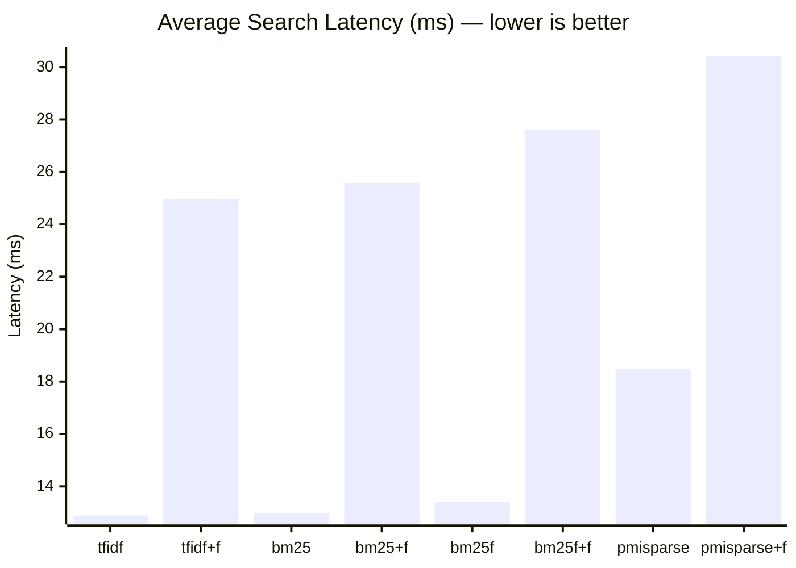
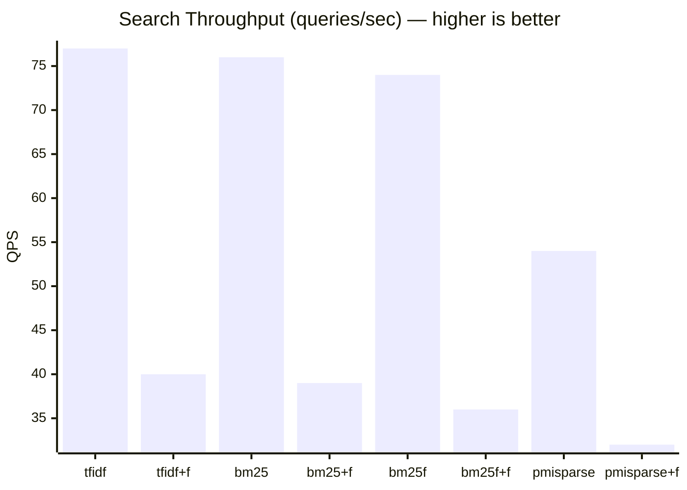

# FTS Algorithm Benchmark

> Auto-generated by `test/search-benchmark.sh` on 2026-03-05 00:39:19

## Environment

| Parameter | Value |
|-----------|-------|
| OS | Darwin 25.3.0 arm64 |
| Go | go1.26.0 |
| Documents | 10000 |
| Queries | 10 diverse queries |
| Iterations | 50 per query per algorithm |
| Total searches | 500 per algorithm config |
| Warmup | 5 queries (discarded) |

## Algorithms

| Algorithm | Description |
|-----------|-------------|
| **tfidf** | Classic TF-IDF term frequency scoring |
| **bm25** | Okapi BM25 probabilistic ranking with length normalization |
| **bm25f** | BM25F field-weighted scoring (title, meta, content) |
| **pmisparse** | BM25 + PMI query expansion (invented by Tradik Limited) |
| **+fuzzy** | Levenshtein distance 1 fuzzy matching variant |

## Latency Results

| Algorithm | Avg (ms) | P50 (ms) | P95 (ms) | P99 (ms) | Min (ms) | Max (ms) | QPS |
|-----------|----------|----------|----------|----------|----------|----------|-----|
| tfidf | 12.89 | 11.38 | 16.17 | 21.01 | 9.66 | 179.53 | 77 |
| tfidf+fuzzy | 24.96 | 24.16 | 28.68 | 36.85 | 22.62 | 82.06 | 40 |
| bm25 | 12.99 | 12.17 | 17.48 | 24.22 | 10.79 | 28.90 | 76 |
| bm25+fuzzy | 25.57 | 24.88 | 29.09 | 31.31 | 23.31 | 90.47 | 39 |
| bm25f | 13.42 | 12.73 | 16.39 | 24.37 | 11.11 | 37.50 | 74 |
| bm25f+fuzzy | 27.62 | 26.33 | 31.80 | 40.49 | 24.78 | 135.87 | 36 |
| pmisparse | 18.49 | 16.75 | 30.28 | 35.68 | 13.57 | 44.17 | 54 |
| pmisparse+fuzzy | 30.42 | 28.61 | 41.57 | 45.84 | 26.09 | 156.37 | 32 |

## Average Latency Comparison

## Throughput Comparison

## Result Counts per Query

Shows how many documents each algorithm returns (limit=10) to verify they all find relevant results.

| Query | tfidf | bm25 | bm25f | pmisparse |
|-------|-------|------|-------|-----------|
| kubernetes deployment cluster | 10 | 10 | 10 | 10 |
| neural network training | 10 | 10 | 10 | 10 |
| database query optimization | 10 | 10 | 10 | 10 |
| machine learning model | 10 | 10 | 10 | 10 |
| security authentication token | 10 | 10 | 10 | 10 |
| cloud infrastructure scaling | 10 | 10 | 10 | 10 |
| data pipeline processing | 10 | 10 | 10 | 10 |
| api gateway middleware | 10 | 10 | 10 | 10 |
| distributed consensus protocol | 10 | 10 | 10 | 10 |
| search algorithm ranking | 10 | 10 | 10 | 10 |

## Notes

- **tfidf**: Fastest for simple keyword matching. No length normalization.
- **bm25**: Slightly more compute than tfidf due to document length normalization. Best general-purpose algorithm.
- **bm25f**: Adds field-level weighting. Slower due to separate field index lookups.
- **pmisparse**: First search triggers lazy PMI matrix training (not included in benchmark). Subsequent searches include PMI expansion overhead.
- **fuzzy**: Adds Levenshtein distance computation. Expected ~2-3x slower than exact matching.
- All benchmarks run on a warm server with FTS indices already built during document insertion.
