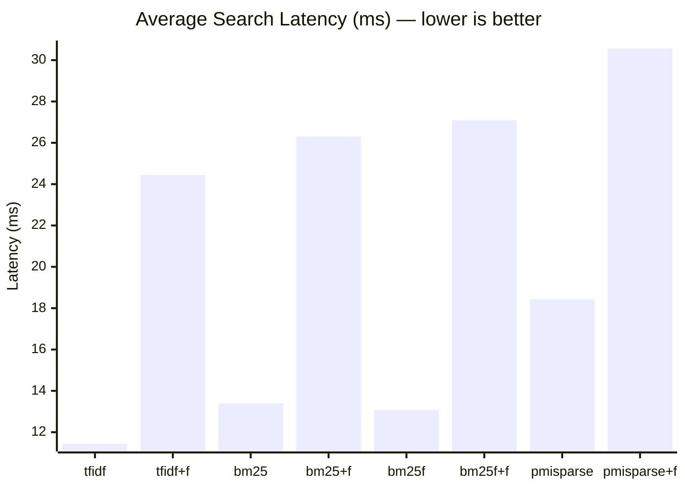
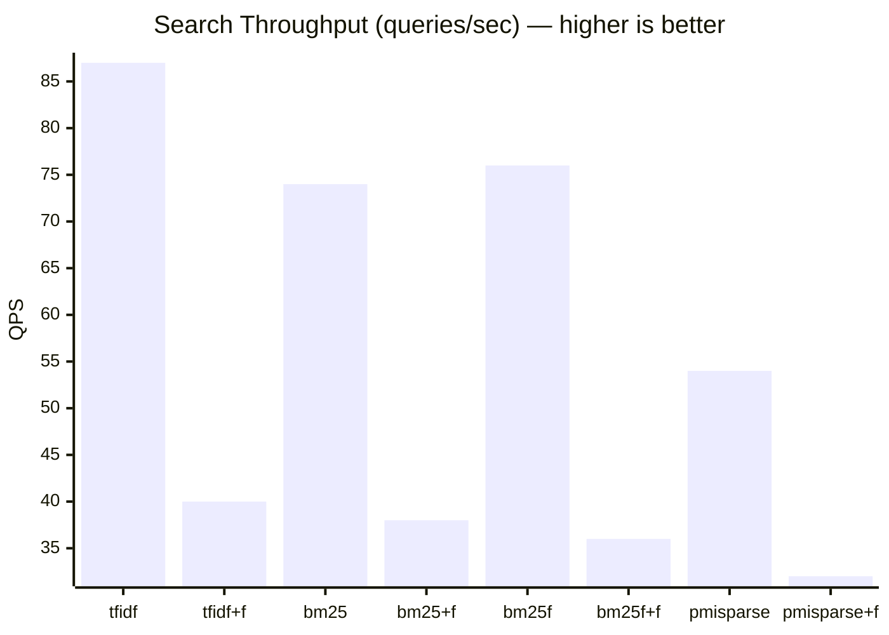

# FTS Algorithm Benchmark

> Auto-generated by `test/search-benchmark.sh` on 2026-03-05 01:13:39

## Environment

| Parameter | Value |
|-----------|-------|
| OS | Darwin 25.3.0 arm64 |
| Go | go1.26.0 |
| Documents | 10000 |
| Queries | 10 diverse queries |
| Iterations | 10 per query per algorithm |
| Runs | 10 (benchmark repeated 10x, results aggregated) |
| Total searches | 1000 per algorithm config |
| Warmup | 5 queries per run (discarded) |

## Algorithms

| Algorithm | Description |
|-----------|-------------|
| **tfidf** | Classic TF-IDF term frequency scoring |
| **bm25** | Okapi BM25 probabilistic ranking with length normalization |
| **bm25f** | BM25F field-weighted scoring (title, meta, content) |
| **pmisparse** | BM25 + PMI query expansion (invented by Tradik Limited) |
| **+fuzzy** | Levenshtein distance 1 fuzzy matching variant |

## Latency Results

| Algorithm | Avg (ms) | P50 (ms) | P95 (ms) | P99 (ms) | Min (ms) | Max (ms) | QPS |
|-----------|----------|----------|----------|----------|----------|----------|-----|
| tfidf | 11.44 | 11.09 | 12.98 | 17.60 | 9.84 | 29.02 | 87 |
| tfidf+fuzzy | 24.44 | 23.71 | 27.34 | 35.54 | 22.39 | 102.60 | 40 |
| bm25 | 13.40 | 12.07 | 16.13 | 35.68 | 10.04 | 224.20 | 74 |
| bm25+fuzzy | 26.31 | 24.87 | 30.44 | 40.56 | 23.03 | 254.57 | 38 |
| bm25f | 13.08 | 12.59 | 16.24 | 18.88 | 10.71 | 26.76 | 76 |
| bm25f+fuzzy | 27.09 | 25.94 | 29.72 | 37.40 | 24.31 | 230.38 | 36 |
| pmisparse | 18.43 | 16.74 | 29.92 | 34.30 | 13.19 | 76.31 | 54 |
| pmisparse+fuzzy | 30.57 | 28.87 | 41.22 | 43.98 | 25.84 | 59.31 | 32 |

## Average Latency Comparison

## Throughput Comparison

## Result Counts per Query

Shows how many documents each algorithm returns (limit=10) to verify they all find relevant results.

| Query | tfidf | bm25 | bm25f | pmisparse |
|-------|-------|------|-------|-----------|
| kubernetes deployment cluster | 10 | 10 | 10 | 10 |
| neural network training | 10 | 10 | 10 | 10 |
| database query optimization | 10 | 10 | 10 | 10 |
| machine learning model | 10 | 10 | 10 | 10 |
| security authentication token | 10 | 10 | 10 | 10 |
| cloud infrastructure scaling | 10 | 10 | 10 | 10 |
| data pipeline processing | 10 | 10 | 10 | 10 |
| api gateway middleware | 10 | 10 | 10 | 10 |
| distributed consensus protocol | 10 | 10 | 10 | 10 |
| search algorithm ranking | 10 | 10 | 10 | 10 |

## Notes

- **tfidf**: Fastest for simple keyword matching. No length normalization.
- **bm25**: Slightly more compute than tfidf due to document length normalization. Best general-purpose algorithm.
- **bm25f**: Adds field-level weighting. Slower due to separate field index lookups.
- **pmisparse**: First search triggers lazy PMI matrix training (not included in benchmark). Subsequent searches include PMI expansion overhead.
- **fuzzy**: Adds Levenshtein distance computation. Expected ~2-3x slower than exact matching.
- All benchmarks run on a warm server with FTS indices already built during document insertion.
