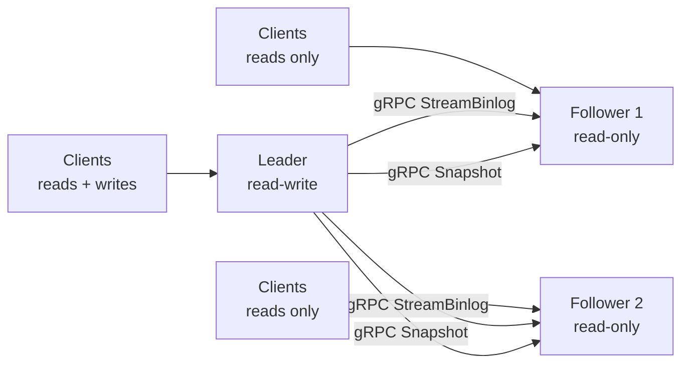
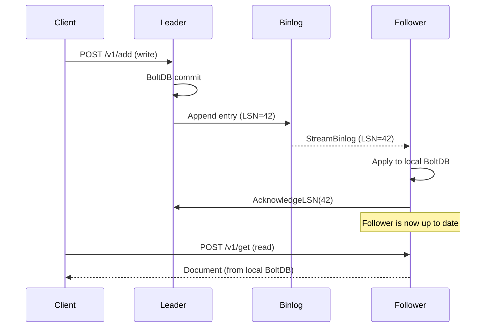
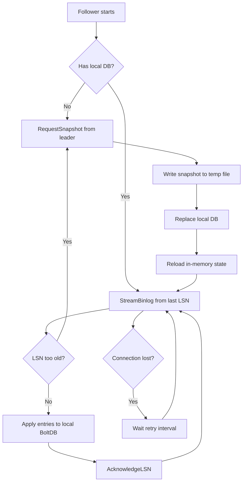
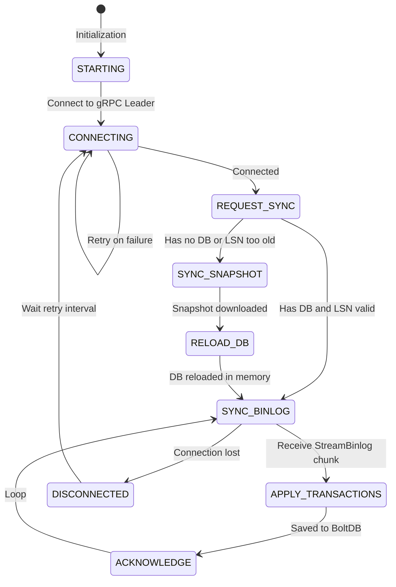

# MDDB Replication (Leader-Follower)

MDDB supports **leader-follower replication** for horizontal read scaling and high availability. A single leader node handles all writes and streams changes to one or more read-only follower nodes via a binary replication log (binlog).

## Architecture



### Replication Flow



### Model

- **Single-leader**: One node accepts writes, followers are read-only
- **Pull-based**: Followers pull changes from the leader via gRPC streaming
- **Eventual consistency**: Followers lag behind the leader by milliseconds (typically <50ms on LAN)
- **Automatic catch-up**: Followers reconnect and catch up after disconnects
- **Full snapshot sync**: New followers receive a full database snapshot before switching to incremental replication

## Quick Start

### 1. Start the Leader

```bash
MDDB_REPLICATION_ROLE=leader \
MDDB_DB_PATH=/data/leader.db \
MDDB_HTTP_PORT=11023 \
MDDB_GRPC_PORT=11024 \
./mddbd
```

The leader automatically enables the binlog and exposes the `MDDBReplication` gRPC service.

### 2. Start a Follower

```bash
MDDB_REPLICATION_ROLE=follower \
MDDB_REPLICATION_LEADER_ADDR=leader-host:11024 \
MDDB_DB_PATH=/data/follower.db \
MDDB_HTTP_PORT=11033 \
MDDB_GRPC_PORT=11034 \
./mddbd
```

The follower:
- Automatically switches to **read-only mode**
- Connects to the leader's gRPC port
- Downloads a full snapshot (if starting fresh)
- Tails the binlog for real-time updates

### 3. Verify Replication

```bash
# Write to leader
curl -X POST http://leader-host:11023/v1/add \
  -H "Content-Type: application/json" \
  -d '{
    "collection": "blog",
    "key": "hello",
    "lang": "en_US",
    "contentMd": "# Hello from leader"
  }'

# Read from follower (after a few ms)
curl -X POST http://follower-host:11033/v1/get \
  -d '{"collection":"blog","key":"hello","lang":"en_US"}'

# Check replication status
curl http://leader-host:11023/v1/replication/status | jq
```

## Docker Compose

```yaml
services:
  leader:
    image: tradik/mddb:latest
    ports:
      - "11023:11023"
      - "11024:11024"
    volumes:
      - leader-data:/data
    environment:
      MDDB_REPLICATION_ROLE: leader
      MDDB_DB_PATH: /data/mddb.db

  follower-1:
    image: tradik/mddb:latest
    ports:
      - "11033:11023"
      - "11034:11024"
    volumes:
      - follower1-data:/data
    environment:
      MDDB_REPLICATION_ROLE: follower
      MDDB_REPLICATION_LEADER_ADDR: leader:11024
      MDDB_DB_PATH: /data/mddb.db
    depends_on:
      leader:
        condition: service_healthy

  follower-2:
    image: tradik/mddb:latest
    ports:
      - "11043:11023"
      - "11044:11024"
    volumes:
      - follower2-data:/data
    environment:
      MDDB_REPLICATION_ROLE: follower
      MDDB_REPLICATION_LEADER_ADDR: leader:11024
      MDDB_DB_PATH: /data/mddb.db
    depends_on:
      leader:
        condition: service_healthy

  panel:
    image: tradik/mddb:panel
    ports:
      - "3000:80"
    environment:
      MDDB_API_URL: http://leader:11023

volumes:
  leader-data:
  follower1-data:
  follower2-data:
```

## Configuration

### Environment Variables

| Variable | Default | Description |
|----------|---------|-------------|
| `MDDB_REPLICATION_ROLE` | `""` (standalone) | Node role: `leader`, `follower`, or empty for standalone |
| `MDDB_REPLICATION_LEADER_ADDR` | - | Follower only: gRPC address of the leader (e.g. `leader:11024`) |
| `MDDB_NODE_ID` | auto-generated | Unique node identifier |
| `MDDB_BINLOG_ENABLED` | `false` | Enable binlog without replication (standalone mode). Auto-enabled for `leader` role |
| `MDDB_BINLOG_PATH` | alongside DB file | Custom binlog file path |
| `MDDB_BINLOG_MAX_SIZE` | `256MB` | Maximum binlog segment size |
| `MDDB_BINLOG_MAX_AGE` | `24h` | Maximum binlog retention time |
| `MDDB_REPLICATION_RETRY_INTERVAL` | `5s` | Follower reconnection interval |
| `MDDB_REPLICATION_MAX_LAG` | `30s` | Maximum lag before follower reports unhealthy |
| `MDDB_REPLICATION_SECRET` | `""` | Shared secret authenticating the snapshot/binlog streams (SEC-001). Set the **same** value on leader and follower. See [Securing replication](#securing-replication). |

### Securing replication

The leader's snapshot and binlog gRPC streams expose the **entire database** — including the `auth_users` (bcrypt password hashes) and `auth_apikeys` buckets — and a live tail of every write. They are therefore gated by `authorizeReplication` (SEC-001), which runs **before** any database access and accepts a request only when one of the following is satisfied:

1. **Shared secret** — set `MDDB_REPLICATION_SECRET` to the same random string (≥ 32 chars) on **both** the leader and every follower. The follower sends it as the `x-mddb-replication-secret` gRPC metadata header; the leader compares it in constant time (`crypto/subtle.ConstantTimeCompare`). This is the simplest option for cross-host links without full mTLS.
2. **mTLS** — a verified client certificate (set `MDDB_TLS_CLIENT_CA` to a trusted-CA PEM bundle) authenticates the follower; no secret needed.
3. **Main auth** — with `MDDB_AUTH_ENABLED=true`, an admin-authenticated context is accepted.

> ⚠️ A node started as `leader` with **none** of these configured refuses every `RequestSnapshot`/`StreamBinlog` call with `PermissionDenied` and logs a loud startup warning. Never expose the gRPC port to an untrusted network without one of the mechanisms above — anyone who can reach it could otherwise exfiltrate the whole database in a single call.

### Role Behavior

| Setting | Writes | Reads | Binlog | Replication |
|---------|--------|-------|--------|-------------|
| (empty / standalone) | Yes | Yes | Off | Off |
| `leader` | Yes | Yes | On | Serves followers |
| `follower` | No (read-only) | Yes | Off | Pulls from leader |

### Follower: Disabled Subsystems

When running as a follower, these subsystems are automatically disabled (they come from the leader's binlog):

- **Embedding Worker** - Embeddings are replicated from the leader
- **TTL Cleanup** - TTL deletions arrive via binlog
- **Index Queue** - Metadata indexing arrives via binlog

## Binlog

The binary replication log records every write operation (Put/Delete) to BoltDB. It serves as the change stream that followers consume.

### Entry Format

```
[lsn:8][type:1][timestamp:8][bucketNameLen:2][bucketName:N][keyLen:4][key:N][valueLen:4][value:N][checksum:4]
```

| Field | Size | Description |
|-------|------|-------------|
| LSN | 8 bytes | Monotonically increasing Log Sequence Number |
| Type | 1 byte | `1`=Put, `2`=Delete |
| Timestamp | 8 bytes | Unix nanoseconds |
| BucketName | 2+N bytes | Target BoltDB bucket |
| Key | 4+N bytes | Document key |
| Value | 4+N bytes | Document value (empty for Delete) |
| Checksum | 4 bytes | CRC32 of the entry |

### Performance

- **Buffered I/O**: 256KB write buffer with periodic flush (100ms)
- **Async flush**: Writes are buffered; fsync happens periodically or on demand
- **Compact format**: Binary serialization (~30% smaller than JSON)
- **Subscriber channels**: Real-time push to followers via Go channels

## gRPC Replication Service

The leader exposes these gRPC methods on the standard gRPC port:

```protobuf
service MDDBReplication {
    rpc RequestSnapshot(SnapshotRequest) returns (stream SnapshotChunk);
    rpc StreamBinlog(StreamBinlogRequest) returns (stream BinlogEntryProto);
    rpc ReplicationStatus(ReplicationStatusRequest) returns (ReplicationStatusResponse);
    rpc AcknowledgeLSN(AcknowledgeLSNRequest) returns (AcknowledgeLSNResponse);
}
```

| Method | Description |
|--------|-------------|
| `RequestSnapshot` | Full BoltDB snapshot streamed in 1MB chunks (uses `bolt.Tx.WriteTo()`) |
| `StreamBinlog` | Historical entries from a given LSN + real-time tailing |
| `ReplicationStatus` | Node role, LSN, lag, follower info |
| `AcknowledgeLSN` | Follower confirms applied LSN (for retention) |

## Follower Sync Flow



### Initial Sync

1. Follower connects with `StreamBinlog(fromLSN=0)`
2. If leader responds with `FailedPrecondition` (LSN too old), follower requests full snapshot
3. Leader streams BoltDB snapshot via `bolt.Tx.WriteTo()` in 1MB chunks (non-blocking read-only transaction)
4. Follower saves to temp file, replaces local DB, reloads in-memory state
5. Follower resumes `StreamBinlog` from the snapshot's LSN

### Reconnection

- Follower retries every `MDDB_REPLICATION_RETRY_INTERVAL` (default 5s)
- If binlog still has the needed LSN: incremental catch-up
- If LSN is too old (binlog rotated): full snapshot re-sync

### Follower State Machine



## Monitoring

### HTTP Endpoint

```bash
GET /v1/replication/status
```

**Leader response:**
```json
{
  "node_id": "leader-1",
  "role": "leader",
  "current_lsn": 45230,
  "binlog_oldest_lsn": 40000,
  "binlog_size_bytes": 15728640,
  "healthy": true,
  "followers": [
    {
      "follower_id": "follower-1",
      "address": "10.0.0.2:11034",
      "confirmed_lsn": 45228,
      "lag_ms": 12,
      "last_seen_at": 1709500000,
      "status": "healthy"
    }
  ],
  "uptime_seconds": 86400
}
```

**Follower response:**
```json
{
  "node_id": "follower-1",
  "role": "follower",
  "current_lsn": 45228,
  "leader_addr": "leader:11024",
  "replication_lag_ms": 12,
  "healthy": true,
  "followers": [],
  "uptime_seconds": 3600
}
```

### Prometheus Metrics

| Metric | Type | Description |
|--------|------|-------------|
| `mddb_replication_role` | gauge | 1=leader, 2=follower, 0=standalone |
| `mddb_replication_lsn` | gauge | Current LSN on this node |
| `mddb_replication_lag_ms` | gauge | Follower replication lag in ms |
| `mddb_binlog_entries_total` | counter | Total binlog entries written |
| `mddb_binlog_size_bytes` | gauge | Current binlog file size |

### Health Check

The `/health` endpoint includes replication status. A follower reports unhealthy if lag exceeds `MDDB_REPLICATION_MAX_LAG` (default 30s).

### Web Panel

The admin panel includes a **Cluster** tab (under Administration) that shows:
- Node role and status badges
- Real-time LSN and binlog statistics
- Connected followers with lag indicators
- Lag history chart (last 5 minutes)

## What Gets Replicated

| Subsystem | Replicated | Notes |
|-----------|:----------:|-------|
| Documents (CRUD) | Yes | All Put/Delete to `docs` bucket |
| Revisions | Yes | All revision entries |
| Metadata indices | Yes | `idxmeta`, `bykey` buckets |
| Vector embeddings | Yes | `vectors` bucket + in-memory index reload |
| Full-text index | Yes | FTS tokens in BoltDB |
| Webhooks | Yes | Config in BoltDB, follower reloads in-memory |
| Schemas | Yes | Config in BoltDB, follower reloads in-memory |
| Auth (users/groups) | Yes | Auth data in BoltDB |
| TTL metadata | Yes | TTL expiry stored with documents |

## Limitations

- **Single leader**: Only one node can accept writes. Multi-leader is not supported.
- **Eventual consistency**: Followers may serve slightly stale reads during replication lag.
- **No automatic failover**: Promoting a follower to leader requires manual reconfiguration.
- **Binlog retention**: If the leader's binlog is rotated before a follower catches up, a full snapshot re-sync is required.
- **gRPC only**: Replication uses gRPC (port 11024). Both leader and follower must have gRPC ports accessible.

## Examples

### Load Balancer Setup (Nginx)

Route writes to leader, reads to any node:

```nginx
upstream mddb_read {
    server leader:11023;
    server follower-1:11033;
    server follower-2:11043;
}

upstream mddb_write {
    server leader:11023;
}

server {
    listen 80;

    # Write endpoints -> leader only
    location ~ ^/v1/(add|delete|import-url|set-ttl|webhooks|schema|truncate|restore) {
        proxy_pass http://mddb_write;
    }

    # Read endpoints -> any node
    location /v1/ {
        proxy_pass http://mddb_read;
    }
}
```

### Kubernetes StatefulSet

```yaml
apiVersion: apps/v1
kind: StatefulSet
metadata:
  name: mddb-follower
spec:
  replicas: 3
  selector:
    matchLabels:
      app: mddb-follower
  template:
    metadata:
      labels:
        app: mddb-follower
    spec:
      containers:
        - name: mddb
          image: tradik/mddb:latest
          env:
            - name: MDDB_REPLICATION_ROLE
              value: "follower"
            - name: MDDB_REPLICATION_LEADER_ADDR
              value: "mddb-leader.default.svc.cluster.local:11024"
            - name: MDDB_DB_PATH
              value: "/data/mddb.db"
          ports:
            - containerPort: 11023
            - containerPort: 11024
          volumeMounts:
            - name: data
              mountPath: /data
  volumeClaimTemplates:
    - metadata:
        name: data
      spec:
        accessModes: ["ReadWriteOnce"]
        resources:
          requests:
            storage: 10Gi
```

### Manual Failover

If the leader goes down:

```bash
# 1. Stop the failed leader

# 2. Promote a follower to leader
MDDB_REPLICATION_ROLE=leader \
MDDB_DB_PATH=/data/mddb.db \
MDDB_HTTP_PORT=11023 \
MDDB_GRPC_PORT=11024 \
./mddbd

# 3. Point other followers to the new leader
# Update MDDB_REPLICATION_LEADER_ADDR and restart
```

## Troubleshooting

| Symptom | Cause | Fix |
|---------|-------|-----|
| Follower stuck at LSN 0 | Can't connect to leader | Check `MDDB_REPLICATION_LEADER_ADDR` and firewall rules |
| "full snapshot required" | Binlog rotated | Follower will auto-snapshot; increase `MDDB_BINLOG_MAX_SIZE` |
| High replication lag | Slow network or overloaded follower | Check network, reduce write load, add followers |
| Follower reports unhealthy | Lag > `MDDB_REPLICATION_MAX_LAG` | Investigate lag cause; increase max lag if acceptable |
| "binlog not enabled" | Leader not configured | Set `MDDB_REPLICATION_ROLE=leader` |

**[Back to Documentation](README.md)**
