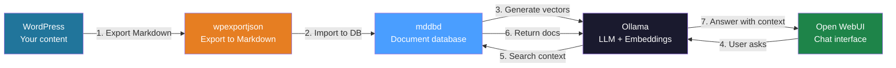
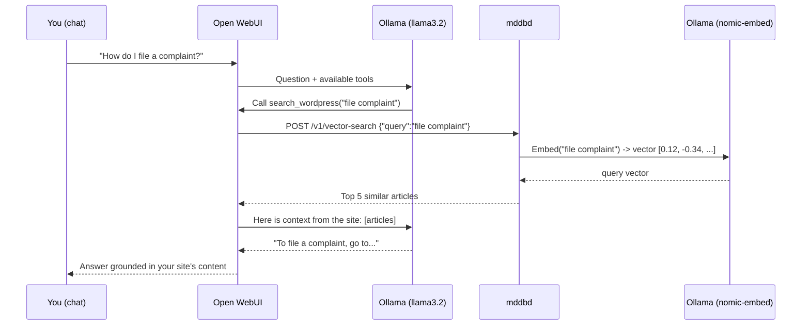

# Build a WordPress AI Agent

A step-by-step guide to building your own AI chatbot for a WordPress site.
The entire stack runs locally on a single machine -- no cloud, no API fees.

## How It Works



## Components

| Component | Role |
|---|---|
| **WordPress** | Your website with content (posts, pages, products) |
| **[wpexportjson](https://github.com/tradik/wpexporter)** | Exports WordPress content to Markdown via REST API |
| **mddbd** | Markdown database -- stores content + vector embeddings |
| **Ollama** | Local AI server -- runs LLM and embedding models |
| **Open WebUI** | Chat interface -- where you talk to the agent |

## Hardware Requirements

| Resource | Minimum | Recommended |
|---|---|---|
| **RAM** | 16 GB | 32 GB |
| **CPU** | 4 cores | 8+ cores |
| **GPU** | none (CPU mode) | NVIDIA 8GB+ VRAM (RTX 3060+) |
| **Disk** | 20 GB free | 50 GB SSD |
| **OS** | Linux / macOS / WSL2 | Linux (Ubuntu 22.04+) |

**Why GPU?** Ollama works on CPU but is ~10x slower. With an NVIDIA GPU (CUDA), responses generate in 1-3 seconds instead of 10-30.

**CPU-only mode:**
- Use smaller models: `llama3.2:3b` instead of `llama3.2:8b`
- The embedding model (`nomic-embed-text`) is lightweight and runs well on CPU
- Responses will be slower but fully functional

## Step 1: Docker Compose

Create `docker-compose.yml`:

```yaml
services:
  # --- Document database ---
  mddb:
    image: ghcr.io/tradik/mddbd:latest
    ports:
      - "11023:11023"   # HTTP API
      - "11024:11024"   # gRPC
    volumes:
      - mddb-data:/data
    environment:
      - MDDB_PATH=/data/mddb.db
      - MDDB_MODE=wr
      # Ollama as embedding provider
      - MDDB_EMBEDDING_PROVIDER=ollama
      - MDDB_EMBEDDING_API_URL=http://ollama:11434
      - MDDB_EMBEDDING_MODEL=nomic-embed-text
      - MDDB_EMBEDDING_DIMENSIONS=768
    healthcheck:
      test: ["CMD", "wget", "-q", "--spider", "http://localhost:11023/health"]
      interval: 10s
      timeout: 3s
    depends_on:
      - ollama

  # --- Local AI (LLM + Embeddings) ---
  ollama:
    image: ollama/ollama:latest
    ports:
      - "11434:11434"
    volumes:
      - ollama-data:/root/.ollama
    # Uncomment the lines below if you have an NVIDIA GPU:
    # deploy:
    #   resources:
    #     reservations:
    #       devices:
    #         - driver: nvidia
    #           count: 1
    #           capabilities: [gpu]

  # --- Chat interface ---
  open-webui:
    image: ghcr.io/open-webui/open-webui:main
    ports:
      - "3000:8080"
    volumes:
      - openwebui-data:/app/backend/data
    environment:
      - OLLAMA_BASE_URL=http://ollama:11434
      - WEBUI_AUTH=false          # Disable login (dev mode)
    depends_on:
      - ollama

volumes:
  mddb-data:
  ollama-data:
  openwebui-data:
```

Start the stack:

```bash
docker compose up -d
```

## Step 2: Pull Ollama Models

Wait for Ollama to start (~30s), then:

```bash
# Embedding model (for vectors) -- lightweight, ~300MB
docker exec -it ollama ollama pull nomic-embed-text

# LLM for conversation -- choose one:
docker exec -it ollama ollama pull llama3.2:3b    # 2GB, fast, good for CPU
# OR
docker exec -it ollama ollama pull llama3.2:8b    # 5GB, better quality, needs GPU
```

Verify MDDB can see Ollama:

```bash
curl http://localhost:11023/v1/vector-stats
# Should show: "enabled": true, "model": "nomic-embed-text"
```

## Step 3: Export from WordPress

Use [wpexportjson](https://github.com/tradik/wpexporter) to export your WordPress content directly to Markdown files with YAML frontmatter.

### Install

```bash
# Option A: Go install
go install github.com/tradik/wpexporter/cmd/wpexporter@latest

# Option B: Docker (no install needed)
docker pull ghcr.io/tradik/wpexporter:latest
```

### Basic export

```bash
# Export all posts and pages to Markdown
wpexportjson export --url https://your-site.com -f markdown --output ./wp-export

# With Docker:
docker run --rm -v $(pwd)/wp-export:/export ghcr.io/tradik/wpexporter:latest \
  wpexportjson export --url https://your-site.com -f markdown --output /export
```

This creates a directory with Markdown files:

```
wp-export/
├── posts/
│   ├── how-to-file-a-complaint.md
│   ├── welcome-to-our-site.md
│   └── ...
├── pages/
│   ├── about.md
│   ├── contact.md
│   └── ...
└── media/
    ├── 123_featured-image.jpg
    └── ...
```

Each `.md` file includes YAML frontmatter with metadata:

```yaml
---
id: 123
title: "How to File a Complaint"
slug: "how-to-file-a-complaint"
date: "2025-03-15T10:30:00"
author: "John Doe"
categories:
  - Support
  - FAQ
tags:
  - complaints
  - customer-service
featured_image: "https://your-site.com/wp-content/uploads/complaint.jpg"
status: "publish"
---

# How to File a Complaint

If you need to file a complaint, follow these steps...
```

### Advanced export options

| Flag | Description |
|---|---|
| `--flat-html` | Convert page builder HTML (Bricks, Elementor, Divi) to clean Markdown |
| `--assisted-crawl` | Extract SEO metadata (title, description, og:tags, hreflangs) |
| `--download-media` | Download images and videos (default: true) |
| `--relevant-media-only` | Only download featured images and content images |
| `--brute-force` | Discover unlisted/hidden content by ID enumeration |
| `--path-filter=/blog/` | Export only specific sections of the site |
| `--no-posts` | Skip blog posts |
| `--no-pages` | Skip pages |
| `--no-products` | Skip WooCommerce products |
| `--resume` | Resume interrupted export from checkpoint |
| `--zip` | Create ZIP archive of export |
| `--crawl-content` | Crawl pages with empty content (page builder sites) |
| `--rate-limit 500` | Delay between requests in ms (prevent rate limiting) |

**Example: page builder site with SEO data**

```bash
wpexportjson export \
  --url https://your-site.com \
  -f markdown \
  --flat-html \
  --assisted-crawl \
  --crawl-content \
  --relevant-media-only \
  --output ./wp-export
```

**Example: export only the blog section**

```bash
wpexportjson export \
  --url https://your-site.com \
  -f markdown \
  --path-filter=/blog/ \
  --output ./wp-export
```

**Example: resume a large interrupted export**

```bash
wpexportjson export \
  --url https://large-site.com \
  -f markdown \
  --resume \
  --output ./wp-export
```

## Step 4: Import into MDDB

The Markdown files from Step 3 already have YAML frontmatter with metadata. Import them with a simple bash loop using `curl` -- no extra tools needed.

### Import with curl (recommended)

```bash
#!/bin/bash
# import-to-mddb.sh -- Import Markdown files to MDDB via HTTP API
MDDB_URL="${MDDB_URL:-http://localhost:11023}"
COLLECTION="${1:?Usage: $0 <collection> <folder> [type]}"
FOLDER="${2:?Usage: $0 <collection> <folder> [type]}"
TYPE="${3:-post}"

count=0
for file in "$FOLDER"/*.md; do
  [ -f "$file" ] || continue
  key=$(basename "$file" .md | tr '[:upper:]' '[:lower:]' | sed 's/[^a-z0-9]/-/g;s/--*/-/g;s/^-//;s/-$//')
  content=$(cat "$file")

  curl -s -X POST "$MDDB_URL/v1/add" \
    -H "Content-Type: application/json" \
    -d "$(jq -n \
      --arg col "$COLLECTION" \
      --arg key "$key" \
      --arg body "$content" \
      --arg type "$TYPE" \
      '{collection: $col, key: $key, lang: "en_US", contentMd: $body, meta: {type: [$type], source: ["wordpress"]}}'
    )" > /dev/null

  count=$((count + 1))
  printf "\r  Imported %d files..." "$count"
done
echo -e "\n  Done: $count files imported to collection '$COLLECTION'"
```

Run it:

```bash
# Import posts
bash import-to-mddb.sh wordpress ./wp-export/posts post

# Import pages
bash import-to-mddb.sh wordpress ./wp-export/pages page
```

That's it. The script needs only `curl` and `jq` (both pre-installed on most systems).

> **Note:** For large imports (1000+ files), metadata parsing, progress bars, and dry-run mode,
> use the full [load-md-folder.sh](https://raw.githubusercontent.com/tradik/mddb/main/scripts/load-md-folder.sh)
> script. It requires `mddb-cli` in PATH. See [Bulk Import Guide](BULK-IMPORT.md).

After import, MDDB automatically generates embeddings (vectors) in the background via Ollama. Check progress:

```bash
curl -s http://localhost:11023/v1/vector-stats | python3 -m json.tool
```

```json
{
  "enabled": true,
  "model": "nomic-embed-text",
  "dimensions": 768,
  "collections": {
    "wordpress": {
      "total_documents": 150,
      "embedded_documents": 142
    }
  }
}
```

When `embedded_documents` == `total_documents`, all content is ready for search.

## Step 5: Add a Tool in Open WebUI

This is the key step. Open **http://localhost:3000** and:

1. Click **profile icon** (bottom left) -> **Admin Panel** -> **Tools**
2. Click **"+" (Create Tool)**
3. Paste the following code:

```python
"""
title: WordPress Search (MDDB)
description: Search WordPress content via MDDB vector database
author: you
version: 1.0.0
requirements: httpx
"""

import httpx
import json
from pydantic import BaseModel, Field


class Tools:
    class Valves(BaseModel):
        MDDB_URL: str = Field(
            default="http://mddb:11023",
            description="MDDB server URL",
        )
        COLLECTION: str = Field(
            default="wordpress",
            description="MDDB collection name",
        )

    def __init__(self):
        self.valves = self.Valves()

    async def search_wordpress(
        self,
        query: str,
        __event_emitter__=None,
    ) -> str:
        """
        Semantic search across WordPress content.
        Use this tool when the user asks about website content.
        :param query: User question, e.g. "how do I file a complaint"
        :return: Matching articles with content
        """
        if __event_emitter__:
            await __event_emitter__(
                {
                    "type": "status",
                    "data": {
                        "description": "Searching WordPress content...",
                        "done": False,
                    },
                }
            )

        async with httpx.AsyncClient(timeout=15) as client:
            resp = await client.post(
                f"{self.valves.MDDB_URL}/v1/vector-search",
                json={
                    "collection": self.valves.COLLECTION,
                    "query": query,
                    "topK": 5,
                    "threshold": 0.5,
                    "includeContent": True,
                },
            )
            data = resp.json()

        results = data.get("results", [])

        if __event_emitter__:
            await __event_emitter__(
                {
                    "type": "status",
                    "data": {
                        "description": f"Found {len(results)} articles",
                        "done": True,
                    },
                }
            )

        if not results:
            return "No matching articles found in the WordPress database."

        output = []
        for r in results:
            doc = r.get("document", {})
            score = r.get("score", 0)
            title = (doc.get("meta", {}).get("title") or [""])[0]
            content = doc.get("contentMd", "")[:2000]
            output.append(
                f"### {title} (relevance: {score:.0%})\n{content}"
            )

        return "\n\n---\n\n".join(output)

    async def search_wordpress_by_category(
        self,
        query: str,
        category: str,
        __event_emitter__=None,
    ) -> str:
        """
        Search WordPress content filtered by category.
        :param query: User question
        :param category: Category name, e.g. "tutorials", "news"
        :return: Matching articles from that category
        """
        if __event_emitter__:
            await __event_emitter__(
                {
                    "type": "status",
                    "data": {
                        "description": f"Searching in category '{category}'...",
                        "done": False,
                    },
                }
            )

        async with httpx.AsyncClient(timeout=15) as client:
            resp = await client.post(
                f"{self.valves.MDDB_URL}/v1/vector-search",
                json={
                    "collection": self.valves.COLLECTION,
                    "query": query,
                    "topK": 5,
                    "threshold": 0.5,
                    "includeContent": True,
                    "filterMeta": {"categories": [category]},
                },
            )
            data = resp.json()

        results = data.get("results", [])

        if __event_emitter__:
            await __event_emitter__(
                {
                    "type": "status",
                    "data": {
                        "description": f"Found {len(results)} articles",
                        "done": True,
                    },
                }
            )

        if not results:
            return f"No articles found in category '{category}'."

        output = []
        for r in results:
            doc = r.get("document", {})
            score = r.get("score", 0)
            title = (doc.get("meta", {}).get("title") or [""])[0]
            content = doc.get("contentMd", "")[:2000]
            output.append(
                f"### {title} (relevance: {score:.0%})\n{content}"
            )

        return "\n\n---\n\n".join(output)

    async def list_wordpress_articles(
        self,
        __event_emitter__=None,
    ) -> str:
        """
        List recent articles from WordPress.
        Use when the user asks "what's on the site?" or "show me articles".
        :return: List of articles with titles
        """
        if __event_emitter__:
            await __event_emitter__(
                {
                    "type": "status",
                    "data": {
                        "description": "Fetching article list...",
                        "done": False,
                    },
                }
            )

        async with httpx.AsyncClient(timeout=15) as client:
            resp = await client.post(
                f"{self.valves.MDDB_URL}/v1/search",
                json={
                    "collection": self.valves.COLLECTION,
                    "sort": "updatedAt",
                    "asc": False,
                    "limit": 20,
                },
            )
            data = resp.json()

        docs = data.get("docs", [])

        if __event_emitter__:
            await __event_emitter__(
                {
                    "type": "status",
                    "data": {
                        "description": f"Fetched {len(docs)} articles",
                        "done": True,
                    },
                }
            )

        if not docs:
            return "No articles in the database."

        lines = []
        for d in docs:
            title = (d.get("meta", {}).get("title") or ["(untitled)"])[0]
            date = (d.get("meta", {}).get("date") or [""])[0][:10]
            lines.append(f"- **{title}** ({date})")

        return "Articles on the site:\n\n" + "\n".join(lines)
```

4. Click **Save**
5. Go back to the chat, select a model (e.g. `llama3.2:3b`)
6. Click the **"+"** icon next to the message field and enable **"WordPress Search (MDDB)"**
7. Ask: *"What articles do you have?"* or *"How do I file a complaint?"*

### What Happens Under the Hood



## Step 6: Set the System Prompt

In Open WebUI chat settings, set the **System Prompt**:

```
You are a helpful assistant for [YOUR WEBSITE NAME].
You answer customer questions based on the website's content.

RULES:
- Always use the search_wordpress tool when the question relates to site content
- If you cannot find an answer in the content, say so honestly
- Cite article titles as sources
- Be helpful and specific
```

## Keeping Content Up to Date

### Option A: Cron job with wpexportjson

```bash
# Re-export and re-import every night at 3:00 AM
0 3 * * * wpexportjson export --url https://your-site.com -f markdown --output /home/user/wp-export && /home/user/load-md-folder.sh /home/user/wp-export/posts wordpress -r -m "type=post" && /home/user/load-md-folder.sh /home/user/wp-export/pages wordpress -r -m "type=page" >> /var/log/mddb-sync.log 2>&1
```

### Option B: WordPress webhooks

Use a WordPress plugin (e.g. WP Webhooks) to call MDDB directly when content changes:

```bash
# WordPress webhook fires on post publish/update
curl -X POST http://localhost:11023/v1/import-url \
  -d '{
    "collection": "wordpress",
    "url": "https://your-site.com/wp-json/wp/v2/posts/123",
    "lang": "en_US"
  }'
```

## Advanced: wpmcp (MCP Server)

The [wpexporter](https://github.com/tradik/wpexporter) toolkit includes **wpmcp** -- an MCP server that lets AI assistants interact with WordPress directly.

### Available tools

| Tool | Description |
|---|---|
| `list_formats` | List all 14 available export formats |
| `get_site_info` | Get WordPress site information |
| `list_posts` | List posts with optional path filtering |
| `list_pages` | List pages from a site |
| `export_site` | Full site export to any format |
| `get_post` | Get a specific post by ID |
| `list_categories` | List all categories |
| `list_media` | List media files |

### Claude Desktop configuration

```json
{
  "mcpServers": {
    "wpexporter": {
      "command": "wpmcp",
      "args": ["serve"]
    }
  }
}
```

### Dual MCP setup (wpexporter + MDDB)

You can use both MCP servers together -- wpmcp for reading live WordPress data, and mddb-mcp for vector search over imported content:

```json
{
  "mcpServers": {
    "wpexporter": {
      "command": "wpmcp",
      "args": ["serve"]
    },
    "mddb": {
      "command": "docker",
      "args": [
        "run", "-i", "--rm", "--network", "host",
        "-e", "MDDB_MCP_STDIO=true",
        "-e", "MDDB_GRPC_ADDRESS=localhost:11024",
        "-e", "MDDB_REST_BASE_URL=http://localhost:11023",
        "tradik/mddb:latest"
      ]
    }
  }
}
```

## Directory Structure

```
your-server/
├── docker-compose.yml          # Full stack (mddb + ollama + open-webui)
├── load-md-folder.sh            # MDDB bulk importer (downloaded from GitHub)
├── wp-export/                   # wpexportjson output
│   ├── posts/                   #   Markdown posts with frontmatter
│   ├── pages/                   #   Markdown pages with frontmatter
│   └── media/                   #   Downloaded images
└── data/                        # Docker volumes
    ├── mddb-data/               #   Documents + vectors
    ├── ollama-data/             #   AI models (~5-10GB)
    └── openwebui-data/          #   Chat settings
```

**Ports:**

| Service | Port | URL |
|---|---|---|
| Open WebUI (chat) | 3000 | http://localhost:3000 |
| MDDB API | 11023 | http://localhost:11023 |
| MDDB gRPC | 11024 | -- |
| Ollama | 11434 | http://localhost:11434 |

---

## FAQ

### How much does it cost?
**$0.** Everything runs locally. The only cost is the server/computer.

### How long does embedding 1000 posts take?
- With GPU: ~5-10 minutes
- CPU only: ~30-60 minutes
- After the initial import, subsequent syncs only embed new/changed posts

### Can I use OpenAI instead of Ollama?
Yes -- change the environment variables in docker-compose:
```yaml
- MDDB_EMBEDDING_PROVIDER=openai
- MDDB_EMBEDDING_API_KEY=sk-xxx
- MDDB_EMBEDDING_MODEL=text-embedding-3-small
- MDDB_EMBEDDING_DIMENSIONS=1536
```
But you lose privacy and pay per token.

### My site uses a page builder (Elementor, Bricks, Divi). Will the export work?
Yes -- use `--flat-html` and `--crawl-content` flags. wpexportjson has built-in conversion rules for Bricks, Elementor, Divi, Oxygen, and GenerateBlocks. You can also define custom rules in a `config.yaml` file. See the [wpexporter documentation](https://github.com/tradik/wpexporter#html-to-markdown-conversion).

### My site has protected content. Can I export it?
Yes -- wpexportjson supports Basic Auth (`--auth-user` / `--auth-pass`) and Bearer tokens (`--auth-token`). For deeper access (drafts, private posts), use **wpxmlrpc** instead:
```bash
wpxmlrpc export --url https://your-site.com \
  --username admin --password mypassword \
  -f markdown --output ./wp-export
```

### The export was interrupted. Do I need to start over?
No -- use `--resume` to continue from where it stopped:
```bash
wpexportjson export --url https://your-site.com -f markdown --resume --output ./wp-export
```

### What about MCP?
MCP (Model Context Protocol) works with Claude Desktop and Windsurf/Cursor.
Open WebUI supports MCP since v0.6.31 (Streamable HTTP transport), but the
Python Tool approach described above is simpler -- zero extra components.

If you want MCP with Open WebUI, use **MCPO** (proxy):
```bash
docker run -p 8000:8000 ghcr.io/open-webui/mcpo:main -- \
  docker exec -i mddb-mcp /app/mddb-mcp-stdio
```
Then in Open WebUI: Admin -> Tools -> Add Server -> MCP (MCPO).

### Can I export WooCommerce products?
Yes -- wpexportjson automatically detects WooCommerce and exports products. Use `--no-products` to skip them if not needed.

---

## Exposing MDDB to External AI Platforms

If you expose MDDB on a public URL (e.g. `https://mddb.your-site.com`), multiple
AI platforms can use it as a knowledge base. Each platform has a different
integration method.

### Claude (Desktop / Code / API)

Claude supports **MCP** natively. Point it at your `mddb-mcp` instance:

```json
{
  "mcpServers": {
    "mddb": {
      "command": "docker",
      "args": [
        "run", "-i", "--rm",
        "-e", "MDDB_MCP_STDIO=true",
        "-e", "MDDB_REST_BASE_URL=https://mddb.your-site.com",
        "tradik/mddb:latest"
      ]
    }
  }
}
```

Claude gets all 23 tools (search, vector search, add, list collections, etc.).

### ChatGPT (Custom GPTs / Actions)

ChatGPT uses **OpenAPI Actions**. MDDB already ships `openapi.yaml` -- upload it
as an Action in ChatGPT's GPT Builder:

1. Go to [ChatGPT GPT Builder](https://chat.openai.com/gpts/editor)
2. Create a new GPT → **Configure** → **Actions** → **Import from URL**
3. Enter: `https://mddb.your-site.com/openapi.yaml`
4. ChatGPT discovers all endpoints automatically
5. Set the system prompt to use `vector-search` for content questions

No MCP needed -- ChatGPT calls the REST API directly.

### DeepSeek / Manus / Other Agents

Any agent that can make HTTP calls works with MDDB's REST API:

```bash
# Vector search
curl -X POST https://mddb.your-site.com/v1/vector-search \
  -H "Content-Type: application/json" \
  -d '{"collection":"wordpress","query":"how to file a complaint","topK":5}'

# Full-text search
curl -X POST https://mddb.your-site.com/v1/search \
  -H "Content-Type: application/json" \
  -d '{"collection":"wordpress","query":"complaint","limit":10}'
```

For agents that support MCP over HTTP (Streamable HTTP transport), run `mddb-mcp`
in HTTP mode:

```bash
docker run -p 8080:8080 \
  -e MDDB_REST_BASE_URL=https://mddb.your-site.com \
  -e MCP_TRANSPORT=http \
  -e MCP_PORT=8080 \
  tradik/mddb:latest
```

### YAML Custom Tools per Website (v2.3.3+)

When exposing MDDB externally, generic tools like `semantic_search(collection, query)`
work -- but the LLM has to guess collection names and parameters. The **custom tools**
feature in `mddb-mcp` lets you define **website-specific tools** in `config.yaml`:

```yaml
# config.yaml
mcp:
  listenAddress: "0.0.0.0:9000"   # dedicated MCP port (or omit to embed on HTTP port)
mddb:
  restBaseUrl: "http://localhost:11023"

custom_tools:
  - name: search_faq
    description: "Search frequently asked questions"
    action: semantic_search          # underlying MDDB operation
    defaults:
      collection: faq
      topK: 3
      threshold: 0.6
    parameters:
      - name: query
        type: string
        required: true
        description: "User question about FAQs"

  - name: search_products
    description: "Find products in the catalog"
    action: semantic_search
    defaults:
      collection: products
      topK: 5
      threshold: 0.5
    parameters:
      - name: query
        type: string
        required: true
        description: "Product name or description"

  - name: latest_blog_posts
    description: "Get the most recent blog posts"
    action: search_documents
    defaults:
      collection: blog
      sort: updatedAt
      asc: false
      limit: 10
    # no parameters = zero-arg tool

  - name: search_docs
    description: "Search technical documentation"
    action: full_text_search
    defaults:
      collection: docs
      limit: 10
    parameters:
      - name: query
        type: string
        required: true
```

**Supported actions** (3 available):
- `semantic_search` → vector/embedding similarity search
- `search_documents` → metadata-based search with sorting
- `full_text_search` → keyword search with TF scoring

**Why this matters for external AI:**

| Without custom tools | With custom tools |
|---|---|
| AI sees: `semantic_search(collection, query, topK, ...)` | AI sees: `search_faq(query)`, `search_products(query)` |
| AI must guess collection names | Collections are preconfigured |
| Same generic description for all | Domain-specific descriptions per tool |
| Works, but requires good system prompt | Works out of the box |

**How it works:**

1. Define custom tools in `config.yaml` under `custom_tools:`
2. `mddb-mcp` validates the config at startup (no conflicts with 23 built-in tools)
3. Custom tools appear alongside built-in tools in `tools/list`
4. When called, defaults are merged with user arguments and delegated to the underlying action
5. Works on both transports: stdio (Claude Desktop) and HTTP

**Call flow:**
```
AI calls: search_faq(query: "reset password")
  → mddb-mcp merges defaults: {collection:faq, topK:3, threshold:0.6, query:"reset password"}
  → delegates to: semantic_search(merged args)
  → returns: vector search results from "faq" collection
```

**Docker example:**
```bash
docker run -i --rm --network host \
  -v ./config.yaml:/app/config.yaml \
  -e MDDB_MCP_STDIO=true \
  -e MDDB_MCP_CONFIG=/app/config.yaml \
  tradik/mddb:latest
```
