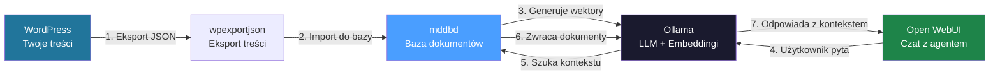
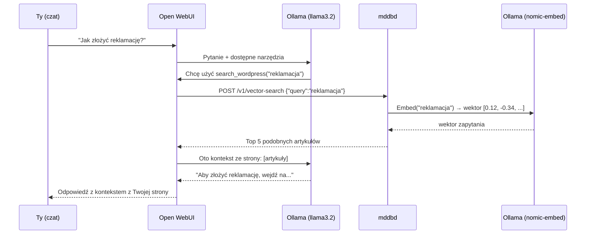

# WordPress AI Agent - krok po kroku

Poradnik jak zbudować własnego AI agenta do swojej strony WordPress.
Cały stack działa lokalnie na jednej maszynie -- bez chmury, bez opłat za API.

## Jak to działa?



## Co potrzebujesz?

| Komponent | Rola |
|---|---|
| **WordPress** | Twoja strona z treściami (posty, strony, produkty) |
| **wpexportjson** | Narzędzie do eksportu treści z WP do JSON |
| **mddbd** | Baza markdown -- przechowuje treści + wektory (embeddingi) |
| **Ollama** | Lokalny serwer AI -- uruchamia modele LLM i embedding |
| **Open WebUI** | Interfejs czatu -- tu rozmawiasz z agentem |

## Wymagania sprzętowe

| Komponent | Minimum | Rekomendowane |
|---|---|---|
| **RAM** | 16 GB | 32 GB |
| **CPU** | 4 rdzenie | 8+ rdzeni |
| **GPU** | brak (CPU mode) | NVIDIA 8GB+ VRAM (RTX 3060+) |
| **Dysk** | 20 GB wolnego | 50 GB SSD |
| **OS** | Linux / macOS / WSL2 | Linux (Ubuntu 22.04+) |

**Dlaczego GPU?** Ollama działa na CPU, ale jest ~10x wolniejsza. Z GPU (NVIDIA CUDA) odpowiedzi generują się w 1-3 sekundy zamiast 10-30.

**Bez GPU (tylko CPU):**
- Używaj mniejszych modeli: `llama3.2:3b` zamiast `llama3.2:8b`
- Embedding model (`nomic-embed-text`) jest lekki i działa dobrze na CPU
- Odpowiedzi będą wolniejsze, ale w pełni funkcjonalne

## Krok 1: Docker Compose

Utwórz plik `docker-compose.yml`:

```yaml
services:
  # --- Baza dokumentów ---
  mddb:
    image: ghcr.io/tradik/mddbd:latest
    ports:
      - "11023:11023"   # HTTP API
      - "11024:11024"   # gRPC
    volumes:
      - mddb-data:/data
    environment:
      - MDDB_PATH=/data/mddb.db
      - MDDB_MODE=wr
      # Ollama jako provider embeddingów
      - MDDB_EMBEDDING_PROVIDER=ollama
      - MDDB_EMBEDDING_API_URL=http://ollama:11434
      - MDDB_EMBEDDING_MODEL=nomic-embed-text
      - MDDB_EMBEDDING_DIMENSIONS=768
    healthcheck:
      test: ["CMD", "wget", "-q", "--spider", "http://localhost:11023/health"]
      interval: 10s
      timeout: 3s
    depends_on:
      - ollama

  # --- Lokalny AI (LLM + Embeddingi) ---
  ollama:
    image: ollama/ollama:latest
    ports:
      - "11434:11434"
    volumes:
      - ollama-data:/root/.ollama
    # Odkomentuj poniższe linie jeśli masz GPU NVIDIA:
    # deploy:
    #   resources:
    #     reservations:
    #       devices:
    #         - driver: nvidia
    #           count: 1
    #           capabilities: [gpu]

  # --- Interfejs czatu ---
  open-webui:
    image: ghcr.io/open-webui/open-webui:main
    ports:
      - "3000:8080"
    volumes:
      - openwebui-data:/app/backend/data
    environment:
      - OLLAMA_BASE_URL=http://ollama:11434
      - WEBUI_AUTH=false          # Wyłącz logowanie (dev)
    depends_on:
      - ollama

volumes:
  mddb-data:
  ollama-data:
  openwebui-data:
```

Uruchom:

```bash
docker compose up -d
```

## Krok 2: Pobierz modele Ollama

Poczekaj aż Ollama wstanie (~30s), potem:

```bash
# Model do embeddingów (wektorów) -- lekki, ~300MB
docker exec -it ollama ollama pull nomic-embed-text

# Model LLM do rozmowy -- wybierz jeden:
docker exec -it ollama ollama pull llama3.2:3b    # 2GB, szybki, dobry na CPU
# LUB
docker exec -it ollama ollama pull llama3.2:8b    # 5GB, lepszy, wymaga GPU
```

Sprawdź czy MDDB widzi Ollama:

```bash
curl http://localhost:11023/v1/vector-stats
# Powinno pokazać: "enabled": true, "model": "nomic-embed-text"
```

## Krok 3: Eksport z WordPress

### Opcja A: wpexportjson (CLI)

```bash
# Zainstaluj narzędzie
pip install wpexportjson

# Eksportuj posty
wpexportjson https://twoja-strona.pl/wp-json/wp/v2/posts \
  --output posts.json \
  --per-page 100
```

### Opcja B: Skrypt bash (bez dodatkowych narzędzi)

```bash
#!/bin/bash
# export-wp.sh - Eksport postów z WordPress REST API

WP_URL="https://twoja-strona.pl"
OUTPUT="wp-posts.json"

echo "[]" > "$OUTPUT"
page=1

while true; do
  echo "Pobieram stronę $page..."
  data=$(curl -s "${WP_URL}/wp-json/wp/v2/posts?per_page=50&page=${page}&_embed")

  # Sprawdź czy są jeszcze wyniki
  count=$(echo "$data" | python3 -c "import sys,json; print(len(json.load(sys.stdin)))" 2>/dev/null)
  if [ "$count" = "0" ] || [ -z "$count" ]; then
    break
  fi

  echo "$data" > "page-${page}.json"
  page=$((page + 1))
done

echo "Pobrano $((page - 1)) stron"
```

## Krok 4: Import do MDDB

```bash
#!/bin/bash
# import-to-mddb.sh - Wgraj posty z WordPress do MDDB

MDDB_URL="http://localhost:11023"
COLLECTION="wordpress"

# Dla każdego pliku page-*.json
for file in page-*.json; do
  echo "Importuję $file..."

  # Parsuj każdy post z pliku JSON
  python3 -c "
import json, subprocess, sys, html, re

with open('$file') as f:
    posts = json.load(f)

for post in posts:
    # Wyciągnij dane
    slug = post.get('slug', '')
    title = post.get('title', {}).get('rendered', '')
    content_html = post.get('content', {}).get('rendered', '')
    date = post.get('date', '')
    categories = [str(c) for c in post.get('categories', [])]
    tags = [str(t) for t in post.get('tags', [])]

    # HTML -> tekst (uproszczony)
    content = re.sub(r'<[^>]+>', '', html.unescape(content_html)).strip()

    # Markdown content
    md = f'# {title}\n\n{content}'

    # Zbuduj request
    doc = {
        'collection': '$COLLECTION',
        'key': slug,
        'lang': 'pl_PL',
        'meta': {
            'title': [title],
            'date': [date],
            'type': ['post'],
            'categories': categories,
            'tags': tags,
        },
        'contentMd': md,
    }

    # Wyślij do MDDB
    import urllib.request
    req = urllib.request.Request(
        '$MDDB_URL/v1/add',
        data=json.dumps(doc).encode(),
        headers={'Content-Type': 'application/json'},
    )
    try:
        resp = urllib.request.urlopen(req)
        print(f'  OK: {slug}')
    except Exception as e:
        print(f'  FAIL: {slug} -> {e}')
"
done

echo ""
echo "Gotowe! Sprawdź statystyki:"
curl -s "$MDDB_URL/v1/stats" | python3 -m json.tool
```

Po imporcie MDDB automatycznie generuje embeddingi (wektory) w tle przez Ollama.
Sprawdź postęp:

```bash
# Ile dokumentów jest już zembeddowanych?
curl -s http://localhost:11023/v1/vector-stats | python3 -m json.tool
```

```json
{
  "enabled": true,
  "model": "nomic-embed-text",
  "dimensions": 768,
  "collections": {
    "wordpress": {
      "total_documents": 150,
      "embedded_documents": 142
    }
  }
}
```

Gdy `embedded_documents` == `total_documents` -- wszystkie treści są gotowe do przeszukiwania.

## Krok 5: Dodaj narzędzie w Open WebUI

To kluczowy krok. Otwórz **http://localhost:3000** i:

1. Kliknij **ikonę profilu** (lewy dół) -> **Admin Panel** -> **Tools**
2. Kliknij **"+" (Create Tool)**
3. Wklej poniższy kod:

```python
"""
title: WordPress Search (MDDB)
description: Przeszukuje bazę treści WordPress przez MDDB
author: you
version: 1.0.0
requirements: httpx
"""

import httpx
import json
from pydantic import BaseModel, Field


class Tools:
    class Valves(BaseModel):
        MDDB_URL: str = Field(
            default="http://mddb:11023",
            description="Adres serwera MDDB",
        )
        COLLECTION: str = Field(
            default="wordpress",
            description="Nazwa kolekcji w MDDB",
        )

    def __init__(self):
        self.valves = self.Valves()

    async def search_wordpress(
        self,
        query: str,
        __event_emitter__=None,
    ) -> str:
        """
        Przeszukaj treści WordPress semantycznie (po znaczeniu).
        Używaj tego narzędzia gdy użytkownik pyta o treści ze strony.
        :param query: Pytanie użytkownika, np. "jak złożyć reklamację"
        :return: Znalezione artykuły z treścią
        """
        if __event_emitter__:
            await __event_emitter__(
                {
                    "type": "status",
                    "data": {
                        "description": "Szukam w bazie WordPress...",
                        "done": False,
                    },
                }
            )

        async with httpx.AsyncClient(timeout=15) as client:
            resp = await client.post(
                f"{self.valves.MDDB_URL}/v1/vector-search",
                json={
                    "collection": self.valves.COLLECTION,
                    "query": query,
                    "topK": 5,
                    "threshold": 0.5,
                    "includeContent": True,
                },
            )
            data = resp.json()

        results = data.get("results", [])

        if __event_emitter__:
            await __event_emitter__(
                {
                    "type": "status",
                    "data": {
                        "description": f"Znaleziono {len(results)} artykułów",
                        "done": True,
                    },
                }
            )

        if not results:
            return "Nie znalazłem pasujących artykułów w bazie WordPress."

        output = []
        for r in results:
            doc = r.get("document", {})
            score = r.get("score", 0)
            title = (doc.get("meta", {}).get("title") or [""])[0]
            content = doc.get("contentMd", "")[:2000]
            output.append(
                f"### {title} (trafność: {score:.0%})\n{content}"
            )

        return "\n\n---\n\n".join(output)

    async def search_wordpress_by_category(
        self,
        query: str,
        category: str,
        __event_emitter__=None,
    ) -> str:
        """
        Przeszukaj treści WordPress filtrując po kategorii.
        :param query: Pytanie użytkownika
        :param category: Nazwa kategorii, np. "poradniki", "aktualności"
        :return: Znalezione artykuły z danej kategorii
        """
        if __event_emitter__:
            await __event_emitter__(
                {
                    "type": "status",
                    "data": {
                        "description": f"Szukam w kategorii '{category}'...",
                        "done": False,
                    },
                }
            )

        async with httpx.AsyncClient(timeout=15) as client:
            resp = await client.post(
                f"{self.valves.MDDB_URL}/v1/vector-search",
                json={
                    "collection": self.valves.COLLECTION,
                    "query": query,
                    "topK": 5,
                    "threshold": 0.5,
                    "includeContent": True,
                    "filterMeta": {"categories": [category]},
                },
            )
            data = resp.json()

        results = data.get("results", [])

        if __event_emitter__:
            await __event_emitter__(
                {
                    "type": "status",
                    "data": {
                        "description": f"Znaleziono {len(results)} artykułów",
                        "done": True,
                    },
                }
            )

        if not results:
            return f"Nie znalazłem artykułów w kategorii '{category}'."

        output = []
        for r in results:
            doc = r.get("document", {})
            score = r.get("score", 0)
            title = (doc.get("meta", {}).get("title") or [""])[0]
            content = doc.get("contentMd", "")[:2000]
            output.append(
                f"### {title} (trafność: {score:.0%})\n{content}"
            )

        return "\n\n---\n\n".join(output)

    async def list_wordpress_articles(
        self,
        __event_emitter__=None,
    ) -> str:
        """
        Wylistuj ostatnie artykuły z WordPress.
        Używaj gdy użytkownik pyta 'co macie na stronie?' lub 'pokaż artykuły'.
        :return: Lista artykułów z tytułami
        """
        if __event_emitter__:
            await __event_emitter__(
                {
                    "type": "status",
                    "data": {
                        "description": "Pobieram listę artykułów...",
                        "done": False,
                    },
                }
            )

        async with httpx.AsyncClient(timeout=15) as client:
            resp = await client.post(
                f"{self.valves.MDDB_URL}/v1/search",
                json={
                    "collection": self.valves.COLLECTION,
                    "sort": "updatedAt",
                    "asc": False,
                    "limit": 20,
                },
            )
            data = resp.json()

        docs = data.get("docs", [])

        if __event_emitter__:
            await __event_emitter__(
                {
                    "type": "status",
                    "data": {
                        "description": f"Pobrano {len(docs)} artykułów",
                        "done": True,
                    },
                }
            )

        if not docs:
            return "Brak artykułów w bazie."

        lines = []
        for d in docs:
            title = (d.get("meta", {}).get("title") or ["(bez tytułu)"])[0]
            date = (d.get("meta", {}).get("date") or [""])[0][:10]
            lines.append(f"- **{title}** ({date})")

        return "Artykuły na stronie:\n\n" + "\n".join(lines)
```

4. Kliknij **Save**
5. Wróć do czatu, wybierz model (np. `llama3.2:3b`)
6. Kliknij ikonę **"+"** obok pola wiadomości i włącz narzędzie **"WordPress Search (MDDB)"**
7. Napisz: *"Jakie artykuły macie na stronie?"* lub *"Jak złożyć reklamację?"*

### Co się dzieje pod spodem?



## Krok 6: Dostosuj system prompt

W Open WebUI, w ustawieniach czatu ustaw **System Prompt**:

```
Jesteś asystentem strony internetowej [NAZWA TWOJEJ STRONY].
Odpowiadasz na pytania klientów na podstawie treści ze strony.

ZASADY:
- Zawsze używaj narzędzia search_wordpress gdy pytanie dotyczy treści strony
- Odpowiadaj po polsku
- Jeśli nie znajdziesz odpowiedzi w treściach, powiedz to uczciwie
- Podawaj tytuły artykułów jako źródło
- Bądź pomocny i konkretny
```

## Automatyczny eksport (cron)

Aby treści były zawsze aktualne, dodaj cron job:

```bash
# Aktualizuj co noc o 3:00
0 3 * * * /home/user/scripts/export-wp.sh && /home/user/scripts/import-to-mddb.sh >> /var/log/mddb-sync.log 2>&1
```

Lub użyj webhooków WordPress (plugin WP Webhooks) -> MDDB `/v1/import-url`:

```bash
# WordPress webhook wywołuje MDDB bezpośrednio
curl -X POST http://localhost:11023/v1/import-url \
  -d '{
    "collection": "wordpress",
    "url": "https://twoja-strona.pl/wp-json/wp/v2/posts/123",
    "lang": "pl_PL"
  }'
```

## Podsumowanie struktury

```
twoj-serwer/
├── docker-compose.yml          # Cały stack
├── scripts/
│   ├── export-wp.sh            # Eksport z WordPress
│   └── import-to-mddb.sh       # Import do MDDB
└── data/                       # Docker volumes
    ├── mddb-data/              #   Baza dokumentów + wektory
    ├── ollama-data/            #   Modele AI (~5-10GB)
    └── openwebui-data/         #   Ustawienia czatu
```

**Porty:**

| Usługa | Port | URL |
|---|---|---|
| Open WebUI (czat) | 3000 | http://localhost:3000 |
| MDDB API | 11023 | http://localhost:11023 |
| MDDB gRPC | 11024 | -- |
| Ollama | 11434 | http://localhost:11434 |

---

## FAQ

### Ile to kosztuje?
**0 zł.** Wszystko działa lokalnie. Jedyny koszt to serwer/komputer.

### Ile trwa embedding 1000 postów?
- Z GPU: ~5-10 minut
- Bez GPU (CPU): ~30-60 minut
- Po pierwszym imporcie, kolejne aktualizacje embeddują tylko nowe/zmienione posty

### Mogę użyć OpenAI zamiast Ollama?
Tak -- zamień zmienne w docker-compose:
```yaml
- MDDB_EMBEDDING_PROVIDER=openai
- MDDB_EMBEDDING_API_KEY=sk-xxx
- MDDB_EMBEDDING_MODEL=text-embedding-3-small
- MDDB_EMBEDDING_DIMENSIONS=1536
```
Ale wtedy tracisz prywatność i płacisz per token.

### A co z MCP?
MCP (Model Context Protocol) działa z Claude Desktop i Windsurf/Cursor.
Open WebUI wspiera MCP od v0.6.31 (Streamable HTTP), ale prostsze jest
podejście z Tool (Python) opisane powyżej -- zero dodatkowych komponentów.

Jeśli chcesz MCP z Open WebUI, użyj **MCPO** (proxy):
```bash
docker run -p 8000:8000 ghcr.io/open-webui/mcpo:main -- \
  docker exec -i mddb-mcp /app/mddb-mcp-stdio
```
Potem w Open WebUI: Admin -> Tools -> Add Server -> MCP (MCPO).

---

## Opinia: Czy można dodać YAML-based custom MCP endpoints?

### Obecny stan

Narzędzia MCP w `mddb-mcp` są **zakodowane na sztywno** w kodzie Go -- 23 narzędzia
zdefiniowane w `tools.go`, `server.go` i `handler.go`. Nie ma mechanizmu
dynamicznej rejestracji przez YAML/JSON.

### Czy to ma sens?

**Tak, ale z zastrzeżeniami.**

Pomysł: plik `custom-tools.yaml` który definiuje dodatkowe endpointy:

```yaml
# custom-tools.yaml (KONCEPT - nie istnieje jeszcze)
custom_tools:
  - name: search_faq
    description: "Szukaj w FAQ"
    endpoint: /v1/vector-search
    method: POST
    defaults:
      collection: faq
      topK: 3
      threshold: 0.6
      includeContent: true
    parameters:
      - name: query
        type: string
        required: true
        description: "Pytanie"

  - name: latest_news
    description: "Pobierz najnowsze aktualności"
    endpoint: /v1/search
    method: POST
    defaults:
      collection: news
      sort: updatedAt
      asc: false
      limit: 5
```

**Zalety:**
- Nie trzeba znać Go -- konfiguracja per strona
- Szybkie wdrożenie specjalizowanych narzędzi
- LLM dostaje lepiej nazwane i opisane narzędzia (np. `search_faq` zamiast generycznego `semantic_search`)

**Problemy:**
- To tylko "aliasy" na istniejące endpointy z domyślnymi parametrami
- Prawdziwe custom narzędzia (np. "wyślij email z ofertą") wymagają logiki, nie konfiga
- LLM i tak potrafi używać generycznego `semantic_search` z dobrym promptem

### Rekomendacja

Zamiast YAML w MCP, lepsze podejście to **Open WebUI Tools** (Python):
- Już masz pełną elastyczność (HTTP requesty, logika, transformacje)
- Konfiguracja przez Valves w GUI (bez restartu)
- Możesz dodać dowolną liczbę narzędzi per strona
- Nie wymaga zmian w kodzie Go

Jeśli jednak wielu użytkowników potrzebuje tego samego -- warto dodać
`custom-tools.yaml` do `mddb-mcp` jako feature request. Implementacja
to ~200 linii Go (parser YAML + dynamiczna rejestracja).
